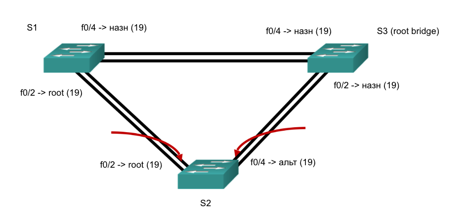

# Домашняя работа #6

## I. Создание сети и настройка основных параметров устройства


> Далее вывожу пинги между свитчами.
```bash
S1#ping 192.168.1.2

Type escape sequence to abort.
Sending 5, 100-byte ICMP Echos to 192.168.1.2, timeout is 2 seconds:
..!!!
Success rate is 60 percent (3/5), round-trip min/avg/max = 0/0/0 ms
```

```bash
S1#ping 192.168.1.3

Type escape sequence to abort.
Sending 5, 100-byte ICMP Echos to 192.168.1.3, timeout is 2 seconds:
..!!!
Success rate is 60 percent (3/5), round-trip min/avg/max = 0/0/0 ms
```

```bash
S2#ping 192.168.1.3

Type escape sequence to abort.
Sending 5, 100-byte ICMP Echos to 192.168.1.3, timeout is 2 seconds:
..!!!
Success rate is 60 percent (3/5), round-trip min/avg/max = 0/0/0 ms
```

## II. Определение корневого моста
### 1. Отключите все порты на коммутаторах
```bash
S1(config)#int range f0/1-24,g0/1-2
S1(config-if-range)#shut
```

### 2. Настройте подключенные порты в качестве транковых.
```bash
S1(config)#int range f0/1-4
S1(config-if-range)#switch mode trunk
```

### 3. Включите порты F0/2 и F0/4 на всех коммутаторах.
```bash
S1(config)#int range f0/2,f0/4
S1(config-if-range)#no shut
```

### 4. Отобразите данные протокола spanning-tree.
> S1
```bash
S1#show span
VLAN0001
  Spanning tree enabled protocol ieee
  Root ID    Priority    32769
             Address     0000.0CD8.DE5C
             Cost        19
             Port        2(FastEthernet0/2)
             Hello Time  2 sec  Max Age 20 sec  Forward Delay 15 sec

  Bridge ID  Priority    32769  (priority 32768 sys-id-ext 1)
             Address     0001.4266.A9E2
             Hello Time  2 sec  Max Age 20 sec  Forward Delay 15 sec
             Aging Time  20

Interface        Role Sts Cost      Prio.Nbr Type
---------------- ---- --- --------- -------- --------------------------------
Fa0/4            Desg FWD 19        128.4    P2p
Fa0/2            Root FWD 19        128.2    P2p
```

> S2
```bash
S2#show span
VLAN0001
  Spanning tree enabled protocol ieee
  Root ID    Priority    32769
             Address     0000.0CD8.DE5C
             Cost        19
             Port        2(FastEthernet0/2)
             Hello Time  2 sec  Max Age 20 sec  Forward Delay 15 sec

  Bridge ID  Priority    32769  (priority 32768 sys-id-ext 1)
             Address     000D.BD17.3B2E
             Hello Time  2 sec  Max Age 20 sec  Forward Delay 15 sec
             Aging Time  20

Interface        Role Sts Cost      Prio.Nbr Type
---------------- ---- --- --------- -------- --------------------------------
Fa0/2            Root FWD 19        128.2    P2p
Fa0/4            Altn BLK 19        128.4    P2p
```

> S3
```bash
S3#show spanning-tree
VLAN0001
  Spanning tree enabled protocol ieee
  Root ID    Priority    32769
             Address     0000.0CD8.DE5C
             This bridge is the root
             Hello Time  2 sec  Max Age 20 sec  Forward Delay 15 sec

  Bridge ID  Priority    32769  (priority 32768 sys-id-ext 1)
             Address     0000.0CD8.DE5C
             Hello Time  2 sec  Max Age 20 sec  Forward Delay 15 sec
             Aging Time  20

Interface        Role Sts Cost      Prio.Nbr Type
---------------- ---- --- --------- -------- --------------------------------
Fa0/2            Desg FWD 19        128.2    P2p
Fa0/4            Desg FWD 19        128.4    P2p
```

**a. В схему ниже запишите роль и состояние (Sts) активных портов на каждом коммутаторе в топологии.**


**b. Какой коммутатор является корневым мостом?**
> S3

**c. Почему этот коммутатор был выбран протоколом spanning-tree в качестве корневого моста?**
> У всех коммутаторов одинаковый приоритет, но у S2 наименьший MAC адресс.

**d. Какие порты на коммутаторе являются корневыми портами?**
> S1 -> f0/2; S2 -> f0/2, порты с наименьшим костом (зависит от ширины канала + близости к root bridge).

**e. Какие порты на коммутаторе являются назначенными портами?**
> S1 -> f0/4; S3 -> f0/2; S2 -> f0/4, порты по которым идет трафик (если dsgn порт упирается в заблокированный alt порт, то трафик уходит в никуда).

**f. Какой порт отображается в качестве альтернативного и в настоящее время заблокирован?**
> S2 -> f0/4, альтернативный порт, который блокируется пока доступен root порт. 

**Почему протокол spanning-tree выбрал этот порт в качестве невыделенного (заблокированного) порта?**
> ! Ранее я дал неполный ответ на этот вопрос ответ на этот вопрос, и сейчас попытаюсь его скорректировать. 
> Тут надо обратить внимание на то что у нас симметричное расположение не-рутовых коммутаторов S1 и S2 относительно рута S3. И веса портов одинаковые. 
> В процессе выбора заблокированного порта сыграло роль то что bridge ID у S1 < S2 (так как его MAC адрес меньше). Поэтому он считается БЛИЖАЙШИМ не-корневым мостом к корневому мосту.
> Поэтому кост транзита от ближайшего не-рутового моста S1 до рутового моста S3 по пути S1 -> S2 -> S3 = 19+19 = 38, что больше чем по пути S1->S3 = 19.

## III. Наблюдение за процессом выбора протоколом STP порта, исходя из стоимости портов
### 1. Определите коммутатор с заблокированным портом.
> S2

### 2. Измените стоимость порта.
> OK

### 3. Просмотрите изменения протокола spanning-tree. 
> (В прошлой итерации я выставил вес 18 не рутовому порту, а заблокированному! Поэтому у меня была ошибка). 

```bash
Interface        Role Sts Cost      Prio.Nbr Type
---------------- ---- --- --------- -------- --------------------------------
Fa0/2            Root FWD 18        128.2    P2p
Fa0/4            Desg LSN 19        128.4    P2p
```

### 4. Удалите изменения стоимости порта

```bash
Interface        Role Sts Cost      Prio.Nbr Type
---------------- ---- --- --------- -------- --------------------------------
Fa0/2            Root FWD 19        128.2    P2p
Fa0/4            Altn BLK 19        128.4    P2p
```


## IV. Наблюдение за процессом выбора протоколом STP порта, исходя из приоритета портов
**a. Включите порты F0/1 и F0/3 на всех коммутаторах.**
```bash
S3(config)#int range f0/1,f0/3
S3(config-if-range)#no shut
```

**b. Подождите 30 секунд, чтобы протокол STP завершил процесс перевода порта, после чего выполните команду show spanning-tree на коммутаторах некорневого моста.***
> S1
```bash
Interface        Role Sts Cost      Prio.Nbr Type
---------------- ---- --- --------- -------- --------------------------------
Fa0/4            Desg FWD 19        128.4    P2p
Fa0/1            Root FWD 19        128.1    P2p
Fa0/2            Altn BLK 19        128.2    P2p
Fa0/3            Desg FWD 19        128.3    P2p
```

> S2
```bash
Interface        Role Sts Cost      Prio.Nbr Type
---------------- ---- --- --------- -------- --------------------------------
Fa0/2            Altn BLK 19        128.2    P2p
Fa0/3            Altn BLK 19        128.3    P2p
Fa0/4            Altn BLK 19        128.4    P2p
Fa0/1            Root FWD 19        128.1    P2p
```

> S3
```bash
Interface        Role Sts Cost      Prio.Nbr Type
---------------- ---- --- --------- -------- --------------------------------
Fa0/1            Desg FWD 19        128.1    P2p
Fa0/2            Desg FWD 19        128.2    P2p
Fa0/3            Desg FWD 19        128.3    P2p
Fa0/4            Desg FWD 19        128.4    P2p
```

**Какой порт выбран протоколом STP в качестве порта корневого моста на каждом коммутаторе некорневого моста?**
> S1 -> f0/1, S2 -> f0/1

**Почему протокол STP выбрал эти порты в качестве портов корневого моста на этих коммутаторах?**
> Для S1 - самый маленький порядковй номер. Концептуально он мог взять f0/2, но у него номер порта выше. Аналогично - для S2.

## Вопросы для повторения
### 1. Какое значение протокол STP использует первым после выбора корневого моста, чтобы определить выбор порта?
> В первую очередь на выбор порта влияет его cost.

### 2. Если первое значение на двух портах одинаково, какое следующее значение будет использовать протокол STP при выборе порта?
> В следующую очередь берется во внимание BID - можем обратить внимание, что поблокировались порты у S2, а не у S1, у S1 BID меньше (он приоритетнее для STP).

### 3. Если оба значения на двух портах равны, каким будет следующее значение, которое использует протокол STP при выборе порта?
> Порядковый номер порта.