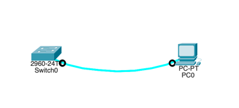
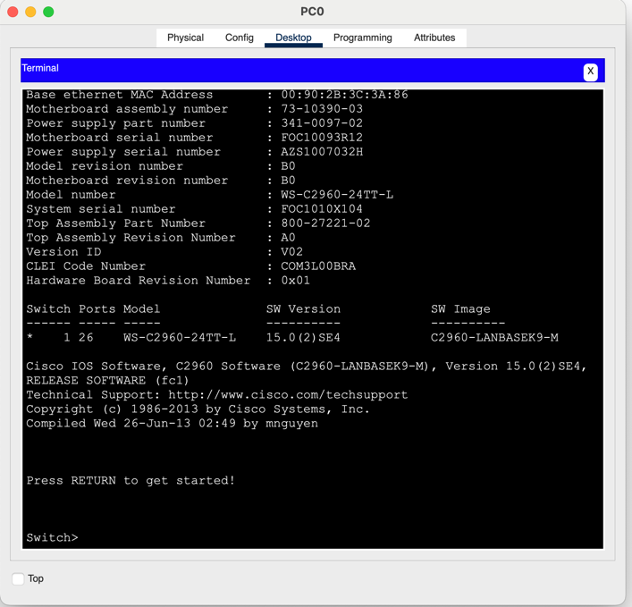
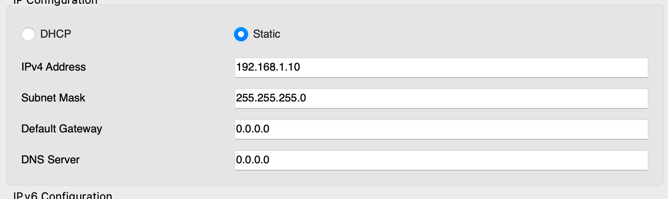

# Домашняя работа #1

## I. Создание сети и проверка настроек коммутатора по умолчанию

## 1.Создайте сеть согласно топологии.
**a. Подсоедините консольный кабель, как показано в топологии. На данном этапе не подключайте кабель Ethernet компьютера PC-A.**
> 

**b. Установите консольное подключение к коммутатору с компьютера PC-A с помощью Tera Term или другой программы эмуляции терминала.**

> 

Почему нужно использовать консольное подключение для первоначальной настройки коммутатора? Почему нельзя подключиться к коммутатору через Telnet или SSH?

> На текущий момент у нас нет сетевого подключения к коммутатору, соответственно ни через Telnet, ни через SSH мы его не увидим.

## 2. Проверьте настройки коммутатора по умолчанию.

**a. Вывести конфигурацию коммутатора.**

``` bash
interface Vlan1
 no ip address
 shutdown
!
!
!
!
line con 0
!
line vty 0 4
 login
line vty 5 15
 login
!
!
!
!
end
```

**b. Изучите текущий файл running configuration.**

Сколько интерфейсов FastEthernet имеется на коммутаторе 2960?
> 24

Сколько интерфейсов GigabitEthernet имеется на коммутаторе 2960?
> 2

Каков диапазон значений, отображаемых в vty-линиях?
> 0-15

**c. Изучите файл загрузочной конфигурации (startup configuration), который содержится в энергонезависимом ОЗУ (NVRAM).**
> Мы видим сообщение со следующим содержанием "startup-config is not present". Это означает что файла конфигурации нет в энергонезависимой памяти. 
```bash
Switch#sh start
startup-config is not present
```

**d. Изучите характеристики SVI для VLAN 1.**
> SVI - это логический интерфейс для VLAN. Его конфигурация доступна в running-config.

```bash
interface Vlan1
 no ip address
 shutdown
```

Назначен ли IP-адрес сети VLAN 1?
> Нет

Какой MAC-адрес имеет SVI? Возможны различные варианты ответов.
> На текущий момент интерфейс выключен, у него нет MAC адреса (ну или я что-то не понимаю =)). Подсмотрел по [ссылке](https://work-systems.ru/komandy-kommutatora-cisco#rec775902689).
```bash
Switch#show mac add
          Mac Address Table
-------------------------------------------

Vlan    Mac Address       Type        Ports
----    -----------       --------    -----
```

Данный интерфейс включен?
> Нет

**e. Изучите IP-свойства интерфейса SVI сети VLAN 1.**
> В конфиге VLAN 1 нет никаких конфигураций связанных с IP.
```brief
Switch#show int vlan 1
Vlan1 is administratively down, line protocol is down
  Hardware is CPU Interface, address is 0090.2b3c.3a86 (bia 0090.2b3c.3a86)
  MTU 1500 bytes, BW 100000 Kbit, DLY 1000000 usec,
     reliability 255/255, txload 1/255, rxload 1/255
  Encapsulation ARPA, loopback not set
  ARP type: ARPA, ARP Timeout 04:00:00
  Last input 21:40:21, output never, output hang never
  Last clearing of "show interface" counters never
  Input queue: 0/75/0/0 (size/max/drops/flushes); Total output drops: 0
  Queueing strategy: fifo
  Output queue: 0/40 (size/max)
  5 minute input rate 0 bits/sec, 0 packets/sec
  5 minute output rate 0 bits/sec, 0 packets/sec
     1682 packets input, 530955 bytes, 0 no buffer
     Received 0 broadcasts (0 IP multicast)
     0 runts, 0 giants, 0 throttles
     0 input errors, 0 CRC, 0 frame, 0 overrun, 0 ignored
     563859 packets output, 0 bytes, 0 underruns
     0 output errors, 23 interface resets
     0 output buffer failures, 0 output buffers swapped out
```

**f. Подсоедините кабель Ethernet компьютера PC-A к порту 6 на коммутаторе и изучите IP-свойства интерфейса SVI сети VLAN 1. Дождитесь согласования параметров скорости и дуплекса между коммутатором и ПК. Какие выходные данные вы видите?**

> Вот тут я не совсем понял что такое выходные данные, но в терминале я вижу что коммутатор распознал подключение и перевел его в состояние UP.

```bash
%LINK-5-CHANGED: Interface FastEthernet0/6, changed state to up

%LINEPROTO-5-UPDOWN: Line protocol on Interface FastEthernet0/6, changed state to up

%LINK-3-UPDOWN: Interface FastEthernet0/6, changed state to down

%LINEPROTO-5-UPDOWN: Line protocol on Interface FastEthernet0/6, changed state to down

%LINK-5-CHANGED: Interface FastEthernet0/6, changed state to up

%LINEPROTO-5-UPDOWN: Line protocol on Interface FastEthernet0/6, changed state to up
```

**g. Изучите сведения о версии ОС Cisco IOS на коммутаторе.**
Под управлением какой версии ОС Cisco IOS работает коммутатор?
> Воспользовался командой __show version__. Под управлением версии 15.0(2)SE4.

Как называется файл образа системы?
> Воспользовался командой __show version__. C2960-LANBASEK9-M

**h. Изучите свойства по умолчанию интерфейса FastEthernet, который используется компьютером PC-A.**

```bash
Switch#show in f0/6
FastEthernet0/6 is up, line protocol is up (connected)
  Hardware is Lance, address is 0001.42b6.8406 (bia 0001.42b6.8406)
 BW 100000 Kbit, DLY 1000 usec,
     reliability 255/255, txload 1/255, rxload 1/255
  Encapsulation ARPA, loopback not set
  Keepalive set (10 sec)
  Full-duplex, 100Mb/s
```

Интерфейс включен или выключен?
> Судя по всему - он автоматически подключился после коннекта кабеля.

Что нужно сделать, чтобы включить интерфейс?
> Видимо, просто подключить кабель.

Какой MAC-адрес у интерфейса?
> Насколько я понял немного погуглив - тут MAC адрес это 0001.42b6.8406. Я думал MAC адреса немного иначе форматирются, типо 00:1A:2B:3C:4D:5E, но видимо тут вопрос конкретно используемой нотации.

Какие настройки скорости и дуплекса заданы в интерфейсе?
> Full-duplex, что бы это ни значило.

**i.Изучите флеш-память.**

Какое имя присвоено образу Cisco IOS?
> 2960-lanbasek9-mz.150-2.SE4

# II. Настройка базовых параметров сетевых устройств

## 1. Настройте базовые параметры коммутатора.

**a.В режиме глобальной конфигурации скопируйте следующие базовые параметры конфигурации и вставьте их в файл на коммутаторе S1.**

```bash
Switch#conf term
Enter configuration commands, one per line.  End with CNTL/Z.
Switch(config)#no ip domain-lookup
Switch(config)#hostname S1
S1(config)#service password-encryption
S1(config)#
S1(config)#enable secret class
S1(config)#banner motd #
Enter TEXT message.  End with the character '#'.
Unauthorized access is strictly prohibited. #
```

**b. Назначьте IP-адрес интерфейсу SVI на коммутаторе. Благодаря этому вы получите возможность удаленного управления коммутатором.**
> Я выставил айпи адрес в соответствии с табличкой в начале домашки.
```bash
S1#conf term
Enter configuration commands, one per line.  End with CNTL/Z.
S1(config)#int vlan 1
S1(config-if)#ip address 192.168.1.2 255.255.255.0
S1(config-if)#no shutdown

S1(config-if)#
%LINK-5-CHANGED: Interface Vlan1, changed state to up

%LINEPROTO-5-UPDOWN: Line protocol on Interface Vlan1, changed state to up
end
S1#
%SYS-5-CONFIG_I: Configured from console by console
```

**c. Доступ через порт консоли также следует ограничить  с помощью пароля. Используйте cisco в качестве пароля для входа в консоль в этом задании. Конфигурация по умолчанию разрешает все консольные подключения без пароля. Чтобы консольные сообщения не прерывали выполнение команд, используйте параметр logging synchronous.**
```bash
S1#conf term
Enter configuration commands, one per line.  End with CNTL/Z.
S1(config)#line con 0
S1(config-line)#password cisco
S1(config-line)#login
S1(config-line)#logging synchronous
S1(config-line)#end
S1#
%SYS-5-CONFIG_I: Configured from console by console
```

**d. Настройте каналы виртуального соединения для удаленного управления (vty), чтобы коммутатор разрешил доступ через Telnet. Если не настроить пароль VTY, будет невозможно подключиться к коммутатору по протоколу Telnet.**
```bash
Enter configuration commands, one per line.  End with CNTL/Z.
S1(config)#line vty 0 15
S1(config-line)#password cisco
S1(config-line)#login
S1(config-line)#end
```

Для чего нужна команда login?
> Без ввода команды login пароль не будет запрашиваться. Как я понимаю - смысл в том что мы вешаем пароль на вход в терминал.

## 2. Настройте IP-адрес на компьютере PC-A.
Назначьте компьютеру IP-адрес и маску подсети в соответствии с таблицей адресации.
1. Перейдите в Панель управления. (Control Panel)
2. В представлении «Категория» выберите « Просмотр состояния сети и задач».
3. Щелкните Изменение параметров адаптера на левой панели.
4. Щелкните правой кнопкой мыши интерфейс Ethernet и выберите «Свойства» .
5. Выберите Протокол Интернета версии 4 (TCP/IPv4) > Свойства.
6. Выберите Использовать следующий IP-адрес и введите IP-адрес и маску подсети  и нажмите ОК.

> По-моему тут какой-то миссматч между описанием действий и тем что есть в эмуляторе, я сделал как было показано на лекции.



# III. Проверка сетевых подключений
## 1. Отобразите конфигурацию коммутатора.
```bash
S1#show run
Building configuration...

Current configuration : 1318 bytes
!
version 15.0
no service timestamps log datetime msec
no service timestamps debug datetime msec
service password-encryption
!
hostname S1
!
enable secret 5 $1$mERr$9cTjUIEqNGurQiFU.ZeCi1
!
!
!
no ip domain-lookup
!
!
!
spanning-tree mode pvst
spanning-tree extend system-id
!
<Скипаю интерфейсы>
!
interface Vlan1
 ip address 192.168.1.2 255.255.255.0
!
banner motd ^C
Unauthorized access is strictly prohibited. ^C
!
!
!
line con 0
 password 7 0822455D0A16
 logging synchronous
 login
!
line vty 0 4
 password 7 0822455D0A16
 login
line vty 5 15
 password 7 0822455D0A16
 login
!
!
!
!
end
```

> Я отмечу что не добавлял default-gateway в рамках выполнения задания. Но добавил его после того как увидел целевой конфиг. Не знаю к чему это относится =) ip http server, ip http secure-server у меня так же нет.

**b. Проверьте параметры VLAN 1.**
> Полоса пропускания = BW 100000 Kbit.

## 2. Протестируйте сквозное соединение, отправив эхо-запрос.

**a. В командной строке компьютера PC-A с помощью утилиты ping проверьте связь сначала с адресом PC-A.**
```bash
C:\>ping 192.168.1.10

Pinging 192.168.1.10 with 32 bytes of data:

Reply from 192.168.1.10: bytes=32 time=9ms TTL=128
Reply from 192.168.1.10: bytes=32 time=10ms TTL=128

Ping statistics for 192.168.1.10:
    Packets: Sent = 2, Received = 2, Lost = 0 (0% loss),
Approximate round trip times in milli-seconds:
    Minimum = 9ms, Maximum = 10ms, Average = 9ms

Control-C
^C
```

**b. Из командной строки компьютера PC-A отправьте эхо-запрос на административный адрес интерфейса SVI коммутатора S1.**
```bash
C:\>ping 192.168.1.2

Pinging 192.168.1.2 with 32 bytes of data:

Request timed out.
Reply from 192.168.1.2: bytes=32 time<1ms TTL=255
Reply from 192.168.1.2: bytes=32 time<1ms TTL=255
Reply from 192.168.1.2: bytes=32 time<1ms TTL=255

Ping statistics for 192.168.1.2:
    Packets: Sent = 4, Received = 3, Lost = 1 (25% loss),
Approximate round trip times in milli-seconds:
    Minimum = 0ms, Maximum = 0ms, Average = 0ms
```

## 3. Проверьте удаленное управление коммутатором S1.
> Я честно не понял что такое TeraTerm, я максимально прямолинейно все сделал через консоль компьютера. Вот полная последовательность действий.

```bash
C:\>telnet 192.168.1.2
Trying 192.168.1.2 ...Open
Unauthorized access is strictly prohibited. 


User Access Verification

Password: 
S1>enable
Password: 
S1#write memory
Building configuration...
[OK]
S1#exit

[Connection to 192.168.1.2 closed by foreign host]
```

# Вопросы для повторения

**Зачем необходимо настраивать пароль VTY для коммутатора?**
> Чтобы предотвратить неавторизованный доступ к устройству.

Что нужно сделать, чтобы пароли не отправлялись в незашифрованном виде
> Вместо незащищенного telnet использовать секурный SSH.
