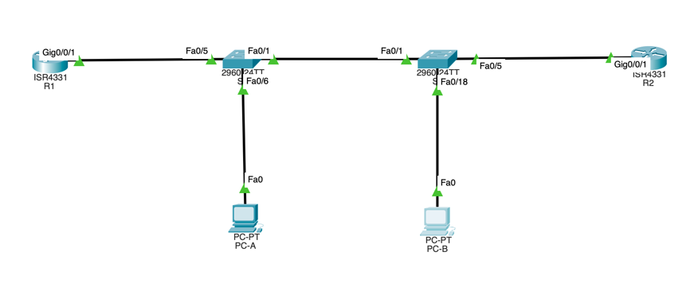

## Часть 1. Создание сети и настройка основных параметров устройства

### 1. Создайте сеть согласно топологии.



### 2. Произведите базовую настройку маршрутизаторов.
> По аналогии с прошлыми ДЗ
### 3. Настройте базовые параметры каждого коммутатора.
> По аналогии с прошлыми ДЗ

## Часть 2. Настройка сетей VLAN на коммутаторах.

### 1. Создайте сети VLAN на коммутаторах.
a. Создайте необходимые VLAN и назовите их на каждом коммутаторе из приведенной выше таблицы.
```bash
S1(config)#vlan 20
S1(config-vlan)#name Management
S1(config-vlan)#vlan 30
S1(config-vlan)#name Operations
S1(config-vlan)#vlan 40
S1(config-vlan)#name Sales
S1(config-vlan)#vlan 999
S1(config-vlan)#name Parking_Lot
S1(config-vlan)#vlan 1000
S1(config-vlan)#name Native 
```

```bash
S2(config)#vlan 20
S2(config-vlan)#name Management
S2(config-vlan)#vlan 30
S2(config-vlan)#name Operations
S2(config-vlan)#vlan 40
S2(config-vlan)#name Sales
S2(config-vlan)#vlan 999
S2(config-vlan)#name Parking_Lot
S2(config-vlan)#vlan 1000
S2(config-vlan)#name Native
```

b. Настройте интерфейс управления и шлюз по умолчанию на каждом коммутаторе, используя информацию об IP-адресе в таблице адресации.
```bash
S2(config)#ip default-gateway 10.20.0.1 
S2(config)#int vlan 20
S2(config-if)#ip addr 10.20.0.3 255.255.255.0
S2(config-if)#no shut
```
```bash
S1(config)#ip default-gateway 10.20.0.1
S1(config)#int vlan 20
S1(config-if)#ip addr 10.20.0.2 255.255.255.0
S1(config-if)#no shut
```

c. Назначьте все неиспользуемые порты коммутатора VLAN Parking Lot, настройте их для статического режима доступа и административно деактивируйте их.
```bash
S1(config-if)# int range f0/2-4,f0/7-24,g0/1-2
S1(config-if-range)#switchport mode access
S1(config-if-range)#switchport access vlan 999
S1(config-if-range)#shut
```

```bash
S2(config-if)#int range f0/2-4,f0/6-17,f0/19-24,g0/1-2
S2(config-if-range)#switchport mode access
S2(config-if-range)#switchport access vlan 999
S2(config-if-range)#shut
```

### 2. Назначьте сети VLAN соответствующим интерфейсам коммутатора.

a. Назначьте используемые порты соответствующей VLAN (указанной в таблице VLAN выше) и настройте их для режима статического доступа.
```bash
	
S1(config-if)#int f0/6
S1(config-if)#switchport mode access
S1(config-if)#switchport access vlan 30
```
```bash
S2(config-if)#int f0/5
S2(config-if)#switchport mode access
S2(config-if)#switchport access vlan 20
S2(config-if)#int f0/18
S2(config-if)#switchport mode access
S2(config-if)#switchport access vlan 40
```

b. Выполните команду show vlan brief, чтобы убедиться, что сети VLAN назначены правильным интерфейсам.

```bash
S1(config-if-range)#do show vlan brief

VLAN Name                             Status    Ports
---- -------------------------------- --------- -------------------------------
1    default                          active    Fa0/1, Fa0/5
20   Management                       active    
30   Operations                       active    Fa0/6
40   Sales                            active    
999  Parking_Lot                      active    Fa0/2, Fa0/3, Fa0/4, Fa0/7
                                                Fa0/8, Fa0/9, Fa0/10, Fa0/11
                                                Fa0/12, Fa0/13, Fa0/14, Fa0/15
                                                Fa0/16, Fa0/17, Fa0/18, Fa0/19
                                                Fa0/20, Fa0/21, Fa0/22, Fa0/23
                                                Fa0/24, Gig0/1, Gig0/2
1000 Native                           active    
1002 fddi-default                     active    
1003 token-ring-default               active    
1004 fddinet-default                  active    
1005 trnet-default                    active
```

```bash
S2(config-if)# do show vlan brief

VLAN Name                             Status    Ports
---- -------------------------------- --------- -------------------------------
1    default                          active    Fa0/1
20   Management                       active    Fa0/5
30   Operations                       active    
40   Sales                            active    Fa0/18
999  Parking_Lot                      active    Fa0/2, Fa0/3, Fa0/4, Fa0/6
                                                Fa0/7, Fa0/8, Fa0/9, Fa0/10
                                                Fa0/11, Fa0/12, Fa0/13, Fa0/14
                                                Fa0/15, Fa0/16, Fa0/17, Fa0/19
                                                Fa0/20, Fa0/21, Fa0/22, Fa0/23
                                                Fa0/24, Gig0/1, Gig0/2
1000 Native                           active    
1002 fddi-default                     active    
1003 token-ring-default               active    
1004 fddinet-default                  active    
1005 trnet-default                    active 
```

## Часть 3. Настройте транки (магистральные каналы).

### 1. Вручную настройте магистральный интерфейс F0/1.
a. Измените режим порта коммутатора на интерфейсе F0/1, чтобы принудительно создать магистральную связь. Не забудьте сделать это на обоих коммутаторах.
b. В рамках конфигурации транка установите для native vlan значение 1000 на обоих коммутаторах. При настройке двух интерфейсов для разных собственных VLAN сообщения об ошибках могут отображаться временно.
c. В качестве другой части конфигурации транка укажите, что VLAN 10, 20, 30 и 1000 разрешены в транке.

```bash
S1(config)#int f0/1
S1(config-if)#switchport mode trunk
S1(config-if)#switchport trunk native vlan 1000
S1(config-if)#switchport trunk allowed vlan 10,20,30,1000
S1(config-if)#switchport nonegotiate
```

```bash
S2(config)#int f0/1
S2(config-if)#switchport mode trunk
S2(config-if)#switchport trunk native vlan 1000
S2(config-if)#switchport trunk allowed vlan 10,20,30,1000
S2(config-if)#switchport nonegotiate
```

d. Выполните команду show interfaces trunk для проверки портов магистрали, собственной VLAN и разрешенных VLAN через магистраль.

```bash
S1(config-if)#do show int trunk
Port        Mode         Encapsulation  Status        Native vlan
Fa0/1       on           802.1q         trunking      1000

Port        Vlans allowed on trunk
Fa0/1       10,20,30,1000

Port        Vlans allowed and active in management domain
Fa0/1       20,30,1000

Port        Vlans in spanning tree forwarding state and not pruned
Fa0/1       20,30,1000
```

```bash
S2(config-if)#do show int trunk
Port        Mode         Encapsulation  Status        Native vlan
Fa0/1       on           802.1q         trunking      1000

Port        Vlans allowed on trunk
Fa0/1       10,20,30,1000

Port        Vlans allowed and active in management domain
Fa0/1       20,30,1000

Port        Vlans in spanning tree forwarding state and not pruned
Fa0/1       20,30,1000
```

### 2. Вручную настройте магистральный интерфейс F0/5 на коммутаторе S1.
a. Настройте интерфейс S1 F0/5 с теми же параметрами транка, что и F0/1. Это транк до маршрутизатора.
b. Сохраните текущую конфигурацию в файл загрузочной конфигурации.

```bash
S1(config-if)#int f0/5
S1(config-if)#switchport mode trunk
S1(config-if)#switchport trunk native vlan 1000
S1(config-if)#switchport trunk allowed vlan 10,20,30,1000
S1(config-if)#switchport nonegotiate
S1(config-if)#do w m
Building configuration...
[OK]
```

c. Используйте команду show interfaces trunk для проверки настроек транка.
> Тут я предварительно включил g0/0/1 на R1, чтобы интерфейс f0/5 активировался и начал отображаться в show int trunk.
```bash
S1(config-if)#do show int trunk
Port        Mode         Encapsulation  Status        Native vlan
Fa0/1       on           802.1q         trunking      1000
Fa0/5       on           802.1q         trunking      1000

Port        Vlans allowed on trunk
Fa0/1       10,20,30,1000
Fa0/5       10,20,30,1000

Port        Vlans allowed and active in management domain
Fa0/1       20,30,1000
Fa0/5       20,30,1000

Port        Vlans in spanning tree forwarding state and not pruned
Fa0/1       20,30,1000
Fa0/5       20,30,1000
```

## Часть 4. Настройте маршрутизацию.
### 1. Настройка маршрутизации между сетями VLAN на R1.
a. Активируйте интерфейс G0/0/1 на маршрутизаторе.
> OK

b. Настройте подинтерфейсы для каждой VLAN, как указано в таблице IP-адресации. Все подинтерфейсы используют инкапсуляцию 802.1Q. Убедитесь, что подинтерфейс для собственной VLAN не имеет назначенного IP-адреса. Включите описание для каждого подинтерфейса.

```bash
R1(config-subif)#int g0/0/1.20
R1(config-subif)#encapsulation dot1Q 20
R1(config-subif)#ip add 10.20.0.1 255.255.255.0
R1(config-subif)#desc Management
R1(config-subif)#no shut
```

```bash
R1(config-subif)#int g0/0/1.30
R1(config-subif)#en dot1Q 30
R1(config-subif)#ip add 10.30.0.1 255.255.255.0
R1(config-subif)#no shut
R1(config-subif)#desc Operations
```

```bash
R1(config-subif)#int g0/0/1.40
R1(config-subif)#en dot1Q 40
R1(config-subif)#ip add 10.40.0.1 255.255.255.0
R1(config-subif)#no shut
R1(config-subif)#desc Sales
```

```bash
R1(config-subif)#int g0/0/1.1000
R1(config-subif)#en dot1Q 1000 native
R1(config-subif)#no ip add
R1(config-subif)#desc Native
R1(config-subif)#end
```

c. Настройте интерфейс Loopback 1 на R1 с адресацией из приведенной выше таблицы.

```bash
R1(config-if)#int lo 1
R1(config-if)#ip add 172.16.1.1 255.255.255.0
R1(config-if)#no shut
```

d. С помощью команды show ip interface brief проверьте конфигурацию подынтерфейса.
```bash
R1(config)#do show ip interface brief
Interface              IP-Address      OK? Method Status                Protocol 
GigabitEthernet0/0/0   unassigned      YES unset  administratively down down 
GigabitEthernet0/0/1   unassigned      YES unset  up                    up 
GigabitEthernet0/0/1.2010.20.0.1       YES manual up                    up 
GigabitEthernet0/0/1.3010.30.0.1       YES manual up                    up 
GigabitEthernet0/0/1.4010.40.0.1       YES manual up                    up 
GigabitEthernet0/0/1.100unassigned      YES unset  administratively down down 
GigabitEthernet0/0/1.1000unassigned      YES unset  up                    up 
GigabitEthernet0/0/2   unassigned      YES unset  administratively down down 
Loopback1              172.16.1.1      YES manual up                    up 
Vlan1                  unassigned      YES unset  administratively down down
```

### 2. Настройка интерфейса R2 g0/0/1 с использованием адреса из таблицы и маршрута по умолчанию с адресом следующего перехода 10.20.0.1
```bash
R2(config)#int g0/0/1
R2(config-if)#ip add 10.20.0.4 255.255.255.0
R2(config-if)#exit
R2(config)#ip route 0.0.0.0 0.0.0.0 10.20.0.1
```

## Часть 5. Настройте удаленный доступ
### 1. Настройте все сетевые устройства для базовой поддержки SSH.

a. Создайте локального пользователя с именем пользователя SSHadmin и зашифрованным паролем $cisco123!
b. Используйте ccna-lab.com в качестве доменного имени.
c. Генерируйте криптоключи с помощью 1024 битного модуля.
d. Настройте первые пять линий VTY на каждом устройстве, чтобы поддерживать только SSH-соединения и с локальной аутентификацией.

```bash
R1(config)#username SSHadmin secret $cisco123!
R1(config)#ip domain name ccna-lab.com
R1(config)#crypto key generate rsa general-keys mod 1024
R1(config)#line vty 0 4
R1(config-line)#transport input ssh
R1(config-line)#login local
R1(config-line)#end
```


### 2. Включите защищенные веб-службы с проверкой подлинности на R1.
a. Включите сервер HTTPS на R1.
b. Настройте R1 для проверки подлинности пользователей, пытающихся подключиться к веб-серверу.

> Тут кажется не работает

```bash
R1(config)#
R1(config)#ip http secure-server 
               ^
% Invalid input detected at '^' marker.
```

##  Часть 6. Проверка подключения
### 1. Настройте узлы ПК.
### 2. Выполните следующие тесты. Эхозапрос должен пройти успешно.

  От     | Протокол  | Назначение    | Успех |
 |--------|-----------|---------------|-------|
| PC-A   | Ping      | 10.40.0.10    | -     |
| PC-A   | Ping      | 10.20.0.1     | +     |
| PC-B   | Ping      | 10.30.0.10    | -     |
| PC-B   | Ping      | 10.20.0.1     | -     |
| PC-B   | Ping      | 172.16.1.1    | -     |
| PC-B   | SSH       | 10.20.0.1     | -     |
| PC-B   | SSH       | 172.16.1.1    | -     |

> **Тут очевидно бага в задании (!)**, PC-B находится в 40-м влане и транк просто не пропустит сейчас сообщения от 40-го влана. Добавлю на свой страх и риск 40й влан в транк на f0/1 (R1,R2) и f0/5 (R1).

  От     | Протокол | Назначение   | Успех |
 |--------|----------|--------------|-------|
| PC-A   | Ping     | 10.40.0.10   | +     |
| PC-A   | Ping     | 10.20.0.1    | +     |
| PC-B   | Ping     | 10.30.0.10   | +     |
| PC-B   | Ping     | 10.20.0.1    | +     |
| PC-B   | Ping     | 172.16.1.1   | +     |
| PC-B   | SSH      | 10.20.0.1    | +     |
| PC-B   | SSH      | 172.16.1.1   | +     |

## Часть 7. Настройка и проверка списков контроля доступа (ACL)
### 1. Проанализируйте требования к сети и политике безопасности для планирования реализации ACL.

> Далее в псевдокоде описываю ACL листы... 

**Политика1. Сеть Sales не может использовать SSH в сети Management (но в  другие сети SSH разрешен).**

> ip access-list extended Sales

> deny tcp 10.40.0.1 0.0.0.255 10.20.0.1 0.0.0.255 eq SSH

**Политика 2. Сеть Sales не имеет доступа к IP-адресам в сети Management с помощью любого веб-протокола (HTTP/HTTPS). Сеть Sales также не имеет доступа к интерфейсам R1 с помощью любого веб-протокола. Разрешён весь другой веб-трафик (обратите внимание — Сеть Sales  может получить доступ к интерфейсу Loopback 1 на R1).**

> ip access-list extended Sales

> deny tcp 10.40.0.1 0.0.0.255 10.20.0.1 0.0.0.255 eq HTTP

> deny tcp 10.40.0.1 0.0.0.255 host 10.30.0.1 eq HTTP

> deny tcp 10.40.0.1 0.0.0.255 host 10.40.0.1 eq HTTP

> =============

> deny tcp 10.40.0.1 0.0.0.255 10.20.0.1 0.0.0.255 eq HTTPS

> deny tcp 10.40.0.1 0.0.0.255 host 10.30.0.1 eq HTTPS

> deny tcp 10.40.0.1 0.0.0.255 host 10.40.0.1 eq HTTPS

> permit any any

**Политика3. Сеть Sales не может отправлять эхо-запросы ICMP в сети Operations или Management. Разрешены эхо-запросы ICMP к другим адресатам.**


> ip access-list extended Sales

> deny icmp 10.40.0.1 0.0.0.255 10.20.0.1 0.0.0.255 echo

> deny icmp 10.40.0.1 0.0.0.255 10.30.0.1 0.0.0.255 echo

> permit any any

**Политика 4: Cеть Operations  не может отправлять ICMP эхозапросы в сеть Sales. Разрешены эхо-запросы ICMP к другим адресатам.**

> ip access-list extended Operations

> deny icmp 10.30.0.1 0.0.0.255 10.40.0.1 0.0.0.255 echo

> permit any any

### 1. Проанализируйте требования к сети и политике безопасности для планирования реализации ACL.
> Здесь потребуется 2 расширенных ACL списка на вход для виртуальных интерфейсов под Sales и Management на R1. Остальное - отлаживаем в процессе...

### 2. Разработка и применение расширенных списков доступа, которые будут соответствовать требованиям политики безопасности.
> Тут я сразу отпишу скрипты, поскольку вбивать по отдельности ACL достаточно муторно. Еще обнаружил что порты для HTTPS, SSH не прописаны, поэтому решил все порты вбивать руками.

> Это ставим на вход g0/0/1.40
```bash
ip access-list extended Sales

deny tcp  10.40.0.1 0.0.0.255 10.20.0.1 0.0.0.255  eq 22

deny tcp  10.40.0.1 0.0.0.255 10.20.0.1 0.0.0.255  eq 80
deny tcp  10.40.0.1 0.0.0.255 10.30.0.1 0.0.0.0    eq 80
deny tcp  10.40.0.1 0.0.0.255 10.40.0.1 0.0.0.0    eq 80

deny tcp  10.40.0.1 0.0.0.255 10.20.0.1 0.0.0.255  eq 443
deny tcp  10.40.0.1 0.0.0.255 10.30.0.1 0.0.0.0    eq 443
deny tcp  10.40.0.1 0.0.0.255 10.40.0.1 0.0.0.0    eq 443

deny icmp 10.40.0.1 0.0.0.255 10.20.0.1 0.0.0.255 echo
deny icmp 10.40.0.1 0.0.0.255 10.30.0.1 0.0.0.255 echo

permit ip any any
```

```bash
int g0/0/1.40
ip access-group Sales in
```

> Это ставим на вход g0/0/1.30
```bash
ip access-list extended Operations
deny icmp 10.30.0.1 0.0.0.255 10.40.0.1 0.0.0.255 echo
permit ip any any
```

```bash
int g0/0/1.30
ip access-group Operations in
```

> Итого,

```bash
Extended IP access list Sales
    10 deny tcp 10.40.0.0 0.0.0.255 10.20.0.0 0.0.0.255 eq 22
    20 deny tcp 10.40.0.0 0.0.0.255 10.20.0.0 0.0.0.255 eq www
    30 deny tcp 10.40.0.0 0.0.0.255 host 10.30.0.1 eq www
    40 deny tcp 10.40.0.0 0.0.0.255 host 10.40.0.1 eq www
    50 deny tcp 10.40.0.0 0.0.0.255 10.20.0.0 0.0.0.255 eq 443
    60 deny tcp 10.40.0.0 0.0.0.255 host 10.30.0.1 eq 443
    70 deny tcp 10.40.0.0 0.0.0.255 host 10.40.0.1 eq 443
    80 deny icmp 10.40.0.0 0.0.0.255 10.20.0.0 0.0.0.255 echo
    90 deny icmp 10.40.0.0 0.0.0.255 10.30.0.0 0.0.0.255 echo
    100 permit ip any any
Extended IP access list Operations
    10 deny icmp 10.30.0.0 0.0.0.255 10.40.0.0 0.0.0.255 echo
    20 permit ip any any
```

### 3. Убедитесь, что политики безопасности применяются развернутыми списками доступа.

  От     | Протокол | Назначение   | Успех |
 |--------|----------|--------------|-------|
| PC-A   | Ping     | 10.40.0.10   | -     |
| PC-A   | Ping     | 10.20.0.1    | +     |
| PC-B   | Ping     | 10.30.0.10   | -     |
| PC-B   | Ping     | 10.20.0.1    | -     |
| PC-B   | Ping     | 172.16.1.1   | +     |
| PC-B   | SSH      | 10.20.0.1    | -     |
| PC-B   | SSH      | 172.16.1.1   | +     |