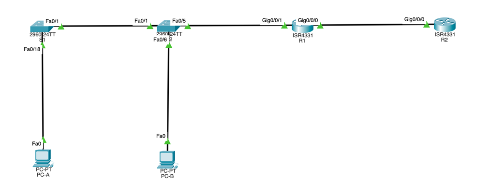

# Часть 1. Создание сети и настройка основных параметров устройства
## 1. Подключите кабели сети согласно приведенной топологии.


## 2. Произведите базовую настройку маршрутизаторов.
> ОК, по аналогии с прошлыми заданиями.

## 3. Настройте базовые параметры каждого коммутатора.
> ОК, по аналогии с прошлыми заданиями.

# Часть 2. Настройка и проверка NAT для IPv4.
## 1. Настройте NAT на R1, используя пул из трех адресов 209.165.200.226-209.165.200.228.

a. Настройте простой список доступа, который определяет, какие хосты будут разрешены для трансляции. В этом случае все устройства в локальной сети R1 имеют право на трансляцию.
b. Создайте пул NAT и укажите ему имя и диапазон используемых адресов.
c. Настройте перевод, связывая ACL и пул с процессом преобразования.
d. Задайте внутренний (inside) интерфейс.
e. Определите внешний (outside) интерфейс.

```bash
R1(config)#access-list 1 permit 192.168.1.0 0.0.0.255
R1(config)#ip nat pool PUBLIC_ACCESS 209.165.200.226 209.165.200.228 netmask 255.255.255.248
R1(config)#ip nat inside source list 1 pool PUBLIC_ACCESS
R1(config)#int g0/0/0
R1(config-if)#ip nat out
R1(config-if)#int g0/0/1
R1(config-if)#ip nat in
```

## 2. Проверьте и проверьте конфигурацию. 
a. С PC-B,  запустите эхо-запрос интерфейса Lo1 (209.165.200.1) на R2. Если эхо-запрос не прошел, выполните процес поиска и устранения неполадок. На R1 отобразите таблицу NAT на R1 с помощью команды show ip nat translations.

> Тут две проблемы нашел, первое - не проставлен дефолтный гейтвей для обоих PC. Во-вторых, не проставлен маршрут для обоих R1 / R2. 
```bash
R1(config)#ip route 0.0.0.0 255.255.255.255 209.165.200.225
R2(config)#ip route 0.0.0.0 255.255.255.255 209.165.200.230
S2(config)#ip default-gateway 192.168.1.1
S1(config)#ip default-gateway 192.168.1.1
```

> Итого,
```bash
R1(config)#do show ip nat trans
Pro  Inside global        Inside local       Outside local      Outside global
icmp 209.165.200.226:43   192.168.1.3:43     209.165.200.1:43   209.165.200.1:43
icmp 209.165.200.226:44   192.168.1.3:44     209.165.200.1:44   209.165.200.1:44
icmp 209.165.200.226:45   192.168.1.3:45     209.165.200.1:45   209.165.200.1:45
icmp 209.165.200.226:46   192.168.1.3:46     209.165.200.1:46   209.165.200.1:46
icmp 209.165.200.226:47   192.168.1.3:47     209.165.200.1:47   209.165.200.1:47
```

Во что был транслирован внутренний локальный адрес PC-B?
> 192.168.1.3 -> 209.165.200.226

Какой тип адреса NAT является переведенным адресом?
> Если честно, не очень помню этот термин с лекции, но думаю это то, во что мы замаппили внутренний адрес, в нашем переведенным будет 209.165.200.226.

b. С PC-A, запустите  эхо-запрос интерфейса Lo1 (209.165.200.1) на R2. Если эхо-запрос не прошел, выполните отладку. На R1 отобразите таблицу NAT на R1 с помощью команды show ip nat translations.
```bash
R1(config)#do show ip nat trans
Pro  Inside global     Inside local       Outside local      Outside global
icmp 209.165.200.226:1 192.168.1.2:1      209.165.200.1:1    209.165.200.1:1
icmp 209.165.200.226:2 192.168.1.2:2      209.165.200.1:2    209.165.200.1:2
icmp 209.165.200.226:3 192.168.1.2:3      209.165.200.1:3    209.165.200.1:3
icmp 209.165.200.226:4 192.168.1.2:4      209.165.200.1:4    209.165.200.1:4
```

c. Обратите внимание, что предыдущая трансляция для PC-B все еще находится в таблице. Из S1, эхо-запрос интерфейса Lo1 (209.165.200.1) на R2. Если эхо-запрос не прошел, выполните отладку. На R1 отобразите таблицу NAT на R1 с помощью команды show ip nat translations.
> В таблице не сохранились старые сопоставления, см. далее. 

d. Теперь запускаем пинг R2 Lo1 из S2. На этот раз перевод завершается неудачей, и вы получаете эти сообщения (или аналогичные) на консоли R1.
> У меня таблица успела очиститься, как и в прошлый раз.
```bash
R1(config)#do show ip nat trans
Pro  Inside global     Inside local       Outside local      Outside global
icmp 209.165.200.226:10192.168.1.12:10    209.165.200.1:10   209.165.200.1:10
icmp 209.165.200.226:7 192.168.1.12:7     209.165.200.1:7    209.165.200.1:7
icmp 209.165.200.226:8 192.168.1.12:8     209.165.200.1:8    209.165.200.1:8
icmp 209.165.200.226:9 192.168.1.12:9     209.165.200.1:9    209.165.200.1:9
```

> Воспроизведу с меньшей задержкой между пингами,
> Сейчас действительно свободные адреса закончили в пуле.

```bash
R1(config)#do show ip nat trans
Pro  Inside global     Inside local       Outside local      Outside global
icmp 209.165.200.226:48192.168.1.3:48     209.165.200.1:48   209.165.200.1:48
icmp 209.165.200.226:49192.168.1.3:49     209.165.200.1:49   209.165.200.1:49
icmp 209.165.200.226:50192.168.1.3:50     209.165.200.1:50   209.165.200.1:50
icmp 209.165.200.226:51192.168.1.3:51     209.165.200.1:51   209.165.200.1:51
icmp 209.165.200.227:5 192.168.1.2:5      209.165.200.1:5    209.165.200.1:5
icmp 209.165.200.227:6 192.168.1.2:6      209.165.200.1:6    209.165.200.1:6
icmp 209.165.200.227:7 192.168.1.2:7      209.165.200.1:7    209.165.200.1:7
icmp 209.165.200.227:8 192.168.1.2:8      209.165.200.1:8    209.165.200.1:8
icmp 209.165.200.228:2 192.168.1.11:2     209.165.200.1:2    209.165.200.1:2
icmp 209.165.200.228:3 192.168.1.11:3     209.165.200.1:3    209.165.200.1:3
icmp 209.165.200.228:4 192.168.1.11:4     209.165.200.1:4    209.165.200.1:4
icmp 209.165.200.228:5 192.168.1.11:5     209.165.200.1:5    209.165.200.1:5
```

```bash
S2#ping 209.165.200.1

Type escape sequence to abort.
Sending 5, 100-byte ICMP Echos to 209.165.200.1, timeout is 2 seconds:
.....
Success rate is 0 percent (0/5)
```

e. Это ожидаемый результат, потому что выделено только 3 адреса, и мы попытались ping Lo1 с четырех устройств. Напомним, что NAT — это трансляция «один-в-один». Как много выделено трансляций? Введите команду show ip nat translations verbose , и вы увидите, что ответ будет 24 часа.

> К сожалению, CPT не поддерживает данный функционал.
```bash
R1#show ip nat trans ?
  <cr>
```

f. Учитывая, что пул ограничен тремя адресами, NAT для пула адресов недостаточно для нашего приложения. Очистите преобразование NAT и статистику, и мы перейдем к PAT.
> Обе команды не работают в CPT
```bash
R1#clear ip nat translations *
                           ^
% Invalid input detected at '^' marker.
	
R1#clear ip nat statistics 
                ^
% Invalid input detected at '^' marker.
```

# Часть 3. Настройка и проверка PAT для IPv4.
## 1. Удалите команду преобразования на R1.
## 2. Добавьте команду PAT на R1.

```bash
R1(config)# no ip nat inside source list 1 pool PUBLIC_ACCESS
R1(config)# ip nat inside source list 1 pool PUBLIC_ACCESS overload
```

## 3. Протестируйте и проверьте конфигурацию.

a. Давайте проверим, что PAT работает. С PC-B,  запустите эхо-запрос интерфейса Lo1 (209.165.200.1) на R2. Если эхо-запрос не прошел, выполните отладку. На R1 отобразите таблицу NAT на R1 с помощью команды show ip nat translations.
```bash
R1(config)#do show ip nat translations
Pro  Inside global        Inside local       Outside local      Outside global
icmp 209.165.200.228:56   192.168.1.3:56     209.165.200.1:56 209.165.200.1:56
icmp 209.165.200.228:57   192.168.1.3:57     209.165.200.1:57 209.165.200.1:57
```

Во что был транслирован внутренний локальный адрес PC-B?
> 192.168.1.3 -> 209.165.200.228

Какой тип адреса NAT является переведенным адресом?
> Вопрос повторяется, как я понимаю - это то, во что мы замаппили внутренний адрес.

Чем отличаются выходные данные команды show ip nat translations из упражнения NAT?
> В целом они ничем не отличаются, во всяком случае для CPT.

b. С PC-A, запустите эхо-запрос интерфейса Lo1 (209.165.200.1) на R2. Если эхо-запрос не прошел, выполните отладку. На R1 отобразите таблицу NAT на R1 с помощью команды show ip nat translations.
```bash
R1>show ip nat translations
Pro  Inside global     Inside local       Outside local      Outside global
icmp 209.165.200.228:29192.168.1.2:29     209.165.200.1:29   209.165.200.1:29
icmp 209.165.200.228:30192.168.1.2:30     209.165.200.1:30   209.165.200.1:30
icmp 209.165.200.228:31192.168.1.2:31     209.165.200.1:31   209.165.200.1:31
```

c. Сгенерируйте трафик с нескольких устройств для наблюдения PAT. На PC-A и PC-B используйте параметр -t с командой ping, чтобы отправить безостановочный ping на интерфейс Lo1 R2 (ping -t 209.165.200.1), затем вернитесь к R1 и выполните команду show ip nat translations:
```bash
Pro  Inside global       Inside local       Outside local      Outside global
icmp 209.165.200.228:21  192.168.1.2:21     209.165.200.1:21   209.165.200.1:21
icmp 209.165.200.228:22  192.168.1.2:22     209.165.200.1:22   209.165.200.1:22
icmp 209.165.200.228:23  192.168.1.2:23     209.165.200.1:23   209.165.200.1:23
icmp 209.165.200.228:24  192.168.1.2:24     209.165.200.1:24   209.165.200.1:24
icmp 209.165.200.228:68  192.168.1.3:68     209.165.200.1:68   209.165.200.1:68
icmp 209.165.200.228:69  192.168.1.3:69     209.165.200.1:69   209.165.200.1:69
icmp 209.165.200.228:70  192.168.1.3:70     209.165.200.1:70   209.165.200.1:70
icmp 209.165.200.228:71  192.168.1.3:71     209.165.200.1:71   209.165.200.1:71
```

Обратите внимание, что внутренний глобальный адрес одинаков для обоих сеансов. Как маршрутизатор отслеживает, куда идут ответы? 
> Он отслеживает внутренний адрес по номеру порта, или в случае ICMP - видимо, порядковому номеру пакета.

d. PAT в пул является очень эффективным решением для малых и средних организаций. Тем не менее есть неиспользуемые адреса IPv4, задействованные в этом сценарии. Мы перейдем к PAT с перегрузкой интерфейса, чтобы устранить эту трату IPv4 адресов. Остановите ping на PC-A и PC-B с помощью комбинации клавиш Control-C, затем очистите трансляции и статистику:
> OK

## 4. На R1 удалите команды преобразования nat pool.
## 5. Добавьте команду PAT overload, указав внешний интерфейс.
```bash
R1(config)#no ip nat inside source list 1 pool PUBLIC_ACCESS overload
R1(config)#no ip nat pool PUBLIC_ACCESS
R1(config)#ip nat inside source list 1 interface g0/0/0 overload
```

a. Давайте проверим PAT, чтобы интерфейс работал. С PC-B,  запустите эхо-запрос интерфейса Lo1 (209.165.200.1) на R2. Если эхо-запрос не прошел, выполните отладку. На R1 отобразите таблицу NAT на R1 с помощью команды show ip nat translations.
```bash
show ip nat translations
Pro  Inside global     Inside local       Outside local      Outside global
icmp 209.165.200.230:76192.168.1.3:76     209.165.200.1:76   209.165.200.1:76
icmp 209.165.200.230:77192.168.1.3:77     209.165.200.1:77   209.165.200.1:77
icmp 209.165.200.230:78192.168.1.3:78     209.165.200.1:78   209.165.200.1:78
icmp 209.165.200.230:79192.168.1.3:79     209.165.200.1:79   209.165.200.1:79
```

b. Сделайте трафик с нескольких устройств для наблюдения PAT. На PC-A и PC-B используйте параметр -t с командой ping для отправки безостановочного ping на интерфейс Lo1 R2 (ping -t 209.165.200.1). На S1 и S2 выполните привилегированную команду exec ping 209.165.200.1 повторить 2000. Затем вернитесь к R1 и выполните команду show ip nat translations.
```bash
R1#show ip nat translations
Pro  Inside global          Inside local       Outside local      Outside global
icmp 209.165.200.230:10     192.168.1.11:10    209.165.200.1:10   209.165.200.1:10
icmp 209.165.200.230:16     192.168.1.12:16    209.165.200.1:16   209.165.200.1:16
icmp 209.165.200.230:17     192.168.1.12:17    209.165.200.1:17   209.165.200.1:17
icmp 209.165.200.230:18     192.168.1.12:18    209.165.200.1:18   209.165.200.1:18
icmp 209.165.200.230:19     192.168.1.12:19    209.165.200.1:19   209.165.200.1:19
icmp 209.165.200.230:20     192.168.1.12:20    209.165.200.1:20   209.165.200.1:20
icmp 209.165.200.230:33     192.168.1.2:33     209.165.200.1:33   209.165.200.1:33
icmp 209.165.200.230:34     192.168.1.2:34     209.165.200.1:34   209.165.200.1:34
icmp 209.165.200.230:35     192.168.1.2:35     209.165.200.1:35   209.165.200.1:35
icmp 209.165.200.230:36     192.168.1.2:36     209.165.200.1:36   209.165.200.1:36
icmp 209.165.200.230:6      192.168.1.11:6     209.165.200.1:6    209.165.200.1:6
icmp 209.165.200.230:7      192.168.1.11:7     209.165.200.1:7    209.165.200.1:7
icmp 209.165.200.230:80     192.168.1.3:80     209.165.200.1:80   209.165.200.1:80
icmp 209.165.200.230:81     192.168.1.3:81     209.165.200.1:81   209.165.200.1:81
icmp 209.165.200.230:82     192.168.1.3:82     209.165.200.1:82   209.165.200.1:82
icmp 209.165.200.230:83     192.168.1.3:83     209.165.200.1:83   209.165.200.1:83
icmp 209.165.200.230:8      192.168.1.11:8     209.165.200.1:8    209.165.200.1:8
icmp 209.165.200.230:9      192.168.1.11:9     209.165.200.1:9    209.165.200.1:9
```

# Часть 4. Настройка и проверка статического NAT для IPv4.
## 1. На R1 очистите текущие трансляции и статистику.
> OK

## 2. На R1 настройте команду NAT, необходимую для статического сопоставления внутреннего адреса с внешним адресом.
```bash
R1(config)#no ip nat inside source list 1 interface g0/0/0 overload
R1(config)#ip nat inside source static 192.168.1.2 209.165.200.229
```

## 3. Протестируйте и проверьте конфигурацию.
a. Давайте проверим, что статический NAT работает. На R1 отобразите таблицу NAT на R1 с помощью команды show ip nat translations, и вы увидите статическое сопоставление.
```bash
R1(config)#do show ip nat translations
Pro  Inside global     Inside local       Outside local      Outside global
---  209.165.200.229   192.168.1.2        ---                ---
```

b. Таблица перевода показывает, что статическое преобразование действует. Проверьте это, запустив ping с R2 на 209.165.200.229. Плинги должны работать.
```bash
R2>ping 209.165.200.229

Type escape sequence to abort.
Sending 5, 100-byte ICMP Echos to 209.165.200.229, timeout is 2 seconds:
.!!!!
Success rate is 80 percent (4/5), round-trip min/avg/max = 0/0/1 ms
```

c. На R1 отобразите таблицу NAT на R1 с помощью команды show ip nat translations, и вы увидите статическое сопоставление и преобразование на уровне порта для входящих pings.

```bash
R1(config)#do show ip nat translations
Pro  Inside global     Inside local       Outside local      Outside global
icmp 209.165.200.229:2 192.168.1.2:2      209.165.200.225:2  209.165.200.225:2
icmp 209.165.200.229:3 192.168.1.2:3      209.165.200.225:3  209.165.200.225:3
icmp 209.165.200.229:4 192.168.1.2:4      209.165.200.225:4  209.165.200.225:4
icmp 209.165.200.229:5 192.168.1.2:5      209.165.200.225:5  209.165.200.225:5
---  209.165.200.229   192.168.1.2        ---                ---
```