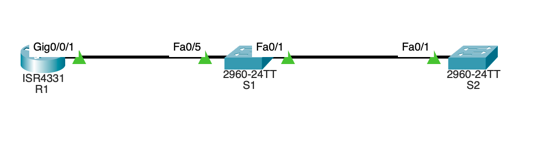

# Настройка протоколов CDP, LLDP и NTP

## Часть 1. Создание сети и настройка основных параметров устройства
### 1. Создайте сеть согласно топологии.



### 2. Настройте базовые параметры для маршрутизатора.
> OK, по аналогии с предыдущими ДЗ
### 3. Настройте базовые параметры каждого коммутатора.
> OK, по аналогии с предыдущими ДЗ

## Часть 2. Обнаружение сетевых ресурсов с помощью протокола CDP
a. На R1 используйте соответствующую команду show cdp, чтобы определить, сколько интерфейсов включено CDP, сколько из них включено и сколько отключено.

> Команда show cdp вероятно не функциональна в CPT, однако по логике - CDP включен на всех интерфейсах, а активен должен быть на всех включенных интерфейсах. Я предварительно включил g0/0/1 - поэтому активен он должен быть только на нем.
```bash
R1#show cdp
Global CDP information:
    Sending CDP packets every 60 seconds
    Sending a holdtime value of 180 seconds
    Sending CDPv2 advertisements is enabled
```

b. На R1 используйте соответствующую команду show cdp, чтобы определить версию IOS, используемую на S1.
> Версия IOS = 15.0(2)SE4
```bash
R1(config)#do show cdp entry S1

Device ID: S1
Entry address(es): 
Platform: cisco 2960, Capabilities: Switch
Interface: GigabitEthernet0/0/1, Port ID (outgoing port): FastEthernet0/5
Holdtime: 179

Version :
Cisco IOS Software, C2960 Software (C2960-LANBASEK9-M), Version 15.0(2)SE4, RELEASE SOFTWARE (fc1)
Technical Support: http://www.cisco.com/techsupport
Copyright (c) 1986-2013 by Cisco Systems, Inc.
Compiled Wed 26-Jun-13 02:49 by mnguyen

advertisement version: 2
Duplex: full
```

c. На S1 используйте соответствующую команду show cdp, чтобы определить, сколько пакетов CDP было выданных.
> К сожалению, в CPT данная команда также недоступна.
```bash
S1#show cdp traffic
            ^
% Invalid input detected at '^' marker.
	
S1#show cdp ?
  entry      Information for specific neighbor entry
  interface  CDP interface status and configuration
  neighbors  CDP neighbor entries
  <cr>
```

d. Настройте SVI для VLAN 1 на S1 и S2, используя IP-адреса, указанные в таблице адресации выше. Настройте шлюз по умолчанию для каждого коммутатора на основе таблицы адресов.
```bash
R1(config)#int lo1
R1(config-if)#ip add 172.16.1.1 255.255.255.0
R1(config-if)#int g0/0/1
R1(config-if)#ip add 10.22.0.1 255.255.255.0
..
S1(config)#int vlan 1
S1(config-if)#ip add 10.22.0.2 255.255.255.0
S1(config-if)#ip default-gateway 10.22.0.1
S1(config-if)#no shut
...
S2(config)#int vlan 1
S2(config-if)#ip add 10.22.0.3 255.255.255.0
S2(config-if)#ip default-gateway 10.22.0.1
S2(config-if)#no shut
```

e. На R1 выполните команду show cdp entry S1 . Какие дополнительные сведения доступны теперь?

> У меня к сожалению ничего не изменилось, подождал пару минут чтобы пакеты CDP распространились, потом рестартнул CPT, но ничего не поменялось. Я думаю просто в CPT эта фича не поддерживается. 
```bash
R1(config-if)#do show cdp ent S1

Device ID: S1
Entry address(es): 
  IP address : 10.22.0.2
Platform: cisco 2960, Capabilities: Switch
Interface: GigabitEthernet0/0/1, Port ID (outgoing port): FastEthernet0/5
Holdtime: 161

Version :
Cisco IOS Software, C2960 Software (C2960-LANBASEK9-M), Version 15.0(2)SE4, RELEASE SOFTWARE (fc1)
Technical Support: http://www.cisco.com/techsupport
Copyright (c) 1986-2013 by Cisco Systems, Inc.
Compiled Wed 26-Jun-13 02:49 by mnguyen

advertisement version: 2
Duplex: full
```

d. Отключить CDP глобально на всех устройствах. 
```bash
R1(config)#no cdp run
S1(config)#no cdp run
S2(config)#no cdp run
```

## Часть 3. Обнаружение сетевых ресурсов с помощью протокола LLDP
a. Введите соответствующую команду lldp, чтобы включить LLDP на всех устройствах в топологии.
```bash
R1(config)#lldp run
S1(config)#lldp run
S2(config)#lldp run
```

b. На S1 выполните соответствующую команду lldp, чтобы предоставить подробную информацию о S2. 
> К сожалению, опять поддержка соответствующего функционала в CPT отсутствует =(
```bash
S1#show lldp ?
  neighbors  LLDP neighbor entries
  <cr>
S1#show lldp entry S2
             ^
% Invalid input detected at '^' marker.
```
> Однако можно сделать вот такой воркэраунд
```bash
S1#show lldp nei det
------------------------------------------------
Chassis id: 0007.EC47.0901
Port id: Fa0/1
Port Description: FastEthernet0/1
System Name: S2
System Description:
Cisco IOS Software, C2960 Software (C2960-LANBASEK9-M), Version 15.0(2)SE4, RELEASE SOFTWARE (fc1)
Technical Support: http://www.cisco.com/techsupport
Copyright (c) 1986-2013 by Cisco Systems, Inc.
Compiled Wed 26-Jun-13 02:49 by mnguyen
Time remaining: 90 seconds
System Capabilities: B
Enabled Capabilities: B
Management Addresses - not advertised
Auto Negotiation - supported, enabled
Physical media capabilities:
    100baseT(FD)
    100baseT(HD)
    1000baseT(HD)
Media Attachment Unit type: 10
Vlan ID: 1
```


Что такое chassis ID  для коммутатора S2?
> Это MAC адрес порта f0/1 к которому подключен S1 на S2.
```bash
S2#show int f0/1
FastEthernet0/1 is up, line protocol is up (connected)
  Hardware is Lance, address is **0007.ec47.0901** (bia 0007.ec47.0901)
```

c. Соединитесь через консоль на всех устройствах и используйте команды LLDP, необходимые для отображения топологии физической сети только из выходных данных команды show.
> Я не совсем понял, что от меня требуется. Но для построения топологии мы можем использовать команду show lldp neighbours.
> Приведенной ниже информации, которая получена из команды show lldp neighbours - достаточно для построения топологии сети.
```bash
R1#show lldp nei
...
Device ID           Local Intf     Hold-time  Capability      Port ID
S1                  Gig0/0/1       120        B               Fa0/5
S1#show lldp nei
...
Device ID           Local Intf     Hold-time  Capability      Port ID
S2                  Fa0/1          120        B               Fa0/1
R1                  Fa0/5          120        R               Gig0/0/1
S2#show lldp nei
...
Device ID           Local Intf     Hold-time  Capability      Port ID
S1                  Fa0/1          120        B               Fa0/1
```

## Часть 4. Настройка NTP
### 1. Выведите на экран текущее время.
```bash
R1#show clock det
*0:40:20.560 UTC Mon Mar 1 1993
Time source is hardware calendar
R1#
```

 Дата          | Время    | Часовой пояс | Источник времени |
 |---------------|----------|--------------|------------------|
| 1 марта 1993г | 00:40:20 | UTC          | hardware clock   |


### 2. Установите время.
```bash
R1#clock set 14:30:00 Dec 14 2025
R1#show clock
14:30:4.479 UTC Sun Dec 14 2025
```

### 3. Настройте главный сервер NTP.
```bash
R1(config)#ntp master 4
R1(config)#do show ntp status
Clock is synchronized, stratum 4, reference is 127.127.1.1
nominal freq is 250.0000 Hz, actual freq is 249.9990 Hz, precision is 2**24
reference time is FFFFFFFFECBB2489.00000142 (14:32:41.322 UTC Sun Dec 14 2025)
clock offset is 0.00 msec, root delay is 0.00  msec
root dispersion is 0.00 msec, peer dispersion is 0.12 msec.
loopfilter state is 'CTRL' (Normal Controlled Loop), drift is - 0.000001193 s/s system poll interval is 4, last update was 10 sec ago.
```

### 4. Настройте клиент NTP.
a. Выполните соответствующую команду на S1 и S2, чтобы просмотреть настроенное время.
```bash
S1#show clock
*0:48:32.757 UTC Mon Mar 1 1993
S2#show clock detail
*0:48:50.711 UTC Mon Mar 1 1993
```

 Свитч | Дата          | Время    | Часовой пояс |
 |-------|---------------|----------|--------------|
| S1    | 1 марта 1993г | 00:48:32 | UTC          |
| S2    | 1 марта 1993г | 00:48:50 | UTC          |

b. Настройте S1 и S2 в качестве клиентов NTP. Используйте соответствующие команды NTP для получения времени от интерфейса G0/0/1 R1, а также для периодического обновления календаря или аппаратных часов коммутатора.
```bash
S1(config)#ntp server 10.22.0.1
...
S2(config)#ntp server 10.22.0.1
```

### 5. Проверьте настройку NTP.
> Где-то через минуту все применилось. Привожу команду для S1, на S2 все аналогично.
```bash
S1#show ntp associations 

address         ref clock       st   when     poll    reach  delay          offset            disp
 ~10.22.0.1     127.127.1.1     4    14       16      37     0.00           1034775930180.00  0.12
 * sys.peer, # selected, + candidate, - outlyer, x falseticker, ~ configured
S1#show clock
14:41:49.49 UTC Sun Dec 14 2025
```

## Вопрос для повторения
Для каких интерфейсов в пределах сети не следует использовать протоколы обнаружения сетевых ресурсов? Поясните ответ.

> Не стоит использовать для "пограничных" интерфейсов, которые соединяют нашу сеть с соседней сетью. Проблема в том, что мы не в ответе за соседнюю сеть, и если злоумышленник получит к ней доступ, то он сможет получить информацию о нашей сети. В частности - ее топпологию, версию IOS, информацию по VLAN, модели устройств.