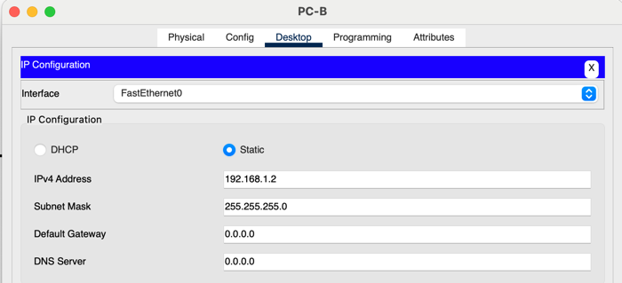

# Домашняя работа #2

## I. Создание и настройка сети

### 1. Подключите сеть в соответствии с топологией


### 2. Настройте все узлы PC

> Далее привожу настройки IP конфигурации обоих PC.

 

### 3. Выполните инициализацию и перезагрузку коммутаторов.
> Тут не совсем понял что нужно сделать, вроде как инициализация выполняется в рамках 4-го задания. 
> Я вызвал reload, на всякий случай, но соединения в онлайн режиме установились между PC и коммутаторами
 
### 4. Настройте базовые параметры каждого коммутатора.

**a. Настройте имена устройств в соответствии с топологией.**
> Скриншот в рамках задания "Подключите сеть в соответствии с топологией" 

**b. Настройте IP-адреса, как указано в таблице адресации.**
> Скриншот в рамках задания "Настройте все узлы PC". Дополнительно прилагаю настройки айпи адресов коммутаторов.

```bash
Enter configuration commands, one per line.  End with CNTL/Z.
S1(config)#int vlan 1
S1(config-if)#ip address 192.168.1.11 255.255.255.0
S1(config-if)#no shutdown

S1(config-if)#
%LINK-5-CHANGED: Interface Vlan1, changed state to up

%LINEPROTO-5-UPDOWN: Line protocol on Interface Vlan1, changed state to up
exit
```

```bash
Enter configuration commands, one per line.  End with CNTL/Z.
S2(config)#int vlan 1
S2(config-if)#ip address 192.168.1.12 255.255.255.0
S2(config-if)#no shutdown

S2(config-if)#
%LINK-5-CHANGED: Interface Vlan1, changed state to up

%LINEPROTO-5-UPDOWN: Line protocol on Interface Vlan1, changed state to up
S2(config-if)#exit
```

**c.Назначьте cisco в качестве паролей консоли и VTY.**
> См. далее.

**d.Назначьте class в качестве пароля доступа к привилегированному режиму EXEC.**


## II. Изучение таблицы MAC-адресов коммутаторов

### 1. Запишите MAC-адреса сетевых устройств

* PC-A >> Physical Address................: 0030.A3DD.5421
* PC-B >> Physical Address................: 00D0.BC9E.92C9
* S-1 >> Hardware is Lance, address is 00e0.8fdc.9701 (bia 00e0.8fdc.9701)
* S-2 >> Hardware is Lance, address is 00e0.b085.ca01 (bia 00e0.b085.ca01)

### 2. Просмотрите таблицу МАС-адресов коммутатора.

**a. Подключитесь к коммутатору S2 через консоль и войдите в привилегированный режим EXEC.**
>> OK

**b. В привилегированном режиме EXEC введите команду show mac address-table и нажмите клавишу ввода.**
```bash
S2#show mac address-table
          Mac Address Table
-------------------------------------------

Vlan    Mac Address       Type        Ports
----    -----------       --------    -----

   1    00e0.8fdc.9701    DYNAMIC     Fa0/1
```

Записаны ли в таблице МАС-адресов какие-либо МАС-адреса? Какие МАС-адреса записаны в таблице?
> Да, и для S1 и для S2 записаны MAC адреса соседних коммутаторов (для S1 это S2 и наоборот)

С какими портами коммутатора они сопоставлены и каким устройствам принадлежат? Игнорируйте МАС-адреса, сопоставленные с центральным процессором.
> Как мы видим, таблица MAC адресов на коммутаторе S2 содержит запись с MAC адресом коммутатора S1 который подключен по порту Fast Ethernet 0/1.

Если вы не записали МАС-адреса сетевых устройств в шаге 1, как можно определить, каким устройствам принадлежат МАС-адреса, используя только выходные данные команды show mac address-table? Работает ли это решение в любой ситуации?
> Самое очевидное - это сопоставить в каждой строке поле порт с реальным подключением по заданному порту. 
> Однако я думаю это не универсальный вариант, поскольку в таблице могут даунстрим подключения (например, S1 -> S2 -> PC-B). 
> Тогда MAC адрес устройства PC-B появится в таблице MAC-адресов S1, но он не будет напрямую подключен к заданному порту.

## III. Очистите таблицу МАС-адресов коммутатора S2 и снова отобразите таблицу МАС-адресов.
> Выполнил все шаги, спустя некоторое время произошла коммутация между свитчами S1 и S2.
```bash
S2#clear mac address-table dynamic
S2#show mac address-table
          Mac Address Table
-------------------------------------------

Vlan    Mac Address       Type        Ports
----    -----------       --------    -----

S2#show mac address-table
          Mac Address Table
-------------------------------------------

Vlan    Mac Address       Type        Ports
----    -----------       --------    -----

   1    00e0.8fdc.9701    DYNAMIC     Fa0/1
```

## IV. С компьютера PC-B отправьте эхо-запросы устройствам в сети и просмотрите таблицу МАС-адресов коммутатора.

**a. На компьютере PC-B откройте командную строку и еще раз введите команду arp -a.**
> У меня команда не задискаверила никаких устройств в сети.
```bash
C:\>arp -a
No ARP Entries Found
```

Не считая адресов многоадресной и широковещательной рассылки, сколько пар IP- и МАС-адресов устройств было получено через протокол ARP?
> Нисколько, НО когда я вручную сделал пинг с PC-A до PC-B, то у меня видимо какой-то путь обнаружился, и с PC-A команда начала работать. Думаю с PC-B ситуация симметричная. Вывожу текстовку терминала.

```bash
C:\>arp -a
No ARP Entries Found
C:\>
C:\>
C:\>ping 192.168.1.2

Pinging 192.168.1.2 with 32 bytes of data:

Reply from 192.168.1.2: bytes=32 time=1ms TTL=128
Reply from 192.168.1.2: bytes=32 time<1ms TTL=128
Reply from 192.168.1.2: bytes=32 time<1ms TTL=128
Reply from 192.168.1.2: bytes=32 time<1ms TTL=128

Ping statistics for 192.168.1.2:
    Packets: Sent = 4, Received = 4, Lost = 0 (0% loss),
Approximate round trip times in milli-seconds:
    Minimum = 0ms, Maximum = 1ms, Average = 0ms

C:\>arp -a
  Internet Address      Physical Address      Type
  192.168.1.2           00d0.bc9e.92c9        dynamic
```

**b. Из командной строки PC-B отправьте эхо-запросы на компьютер PC-A, а также коммутаторы S1 и S2.**
> Все пропинговалось. 
```bash
C:\>ping 192.168.1.1

Pinging 192.168.1.1 with 32 bytes of data:

Reply from 192.168.1.1: bytes=32 time<1ms TTL=128
...

C:\>ping 192.168.1.11

Pinging 192.168.1.11 with 32 bytes of data:

Request timed out.
Reply from 192.168.1.11: bytes=32 time<1ms TTL=255
...

C:\>ping 192.168.1.12

Pinging 192.168.1.12 with 32 bytes of data:

Request timed out.
Reply from 192.168.1.12: bytes=32 time<1ms TTL=255
...
```

**c. Подключившись через консоль к коммутатору S2, введите команду show mac address-table.**
```bash
S2>show mac address-table
          Mac Address Table
-------------------------------------------

Vlan    Mac Address       Type        Ports
----    -----------       --------    -----

   1    00e0.8fdc.9701    DYNAMIC     Fa0/1
```
Добавил ли коммутатор в таблицу МАС-адресов дополнительные МАС-адреса? Если да, то какие адреса и устройства?
> Нет, ничего не добавил. Я сначала расстроился, потом провел такой эксперимент - открыл консоль S2 и консоль PC-B. В консоли PC-B пинганул PC-A и сразу же вывел таблицу адресов в S2, и, о чудо, все появилось (скрин). 
> У меня гипотеза, что у записей в таблице мак адресов очень маленький TTL.


На компьютере PC-B откройте командную строку и еще раз введите команду arp -a.
```bash
C:\>arp -a
  Internet Address      Physical Address      Type
  192.168.1.1           0030.a3dd.5421        dynamic
  192.168.1.11          00e0.f9db.27b8        dynamic
  192.168.1.12          00e0.8f8c.8389        dynamic
```

Появились ли в ARP-кэше компьютера PC-B дополнительные записи для всех сетевых устройств, которым были отправлены эхо-запросы?
> Да, появились адреса всех устройств в сети после того как мы их пропинговали.

В сетях Ethernet данные передаются на устройства по соответствующим МАС-адресам. 
Для этого коммутаторы и компьютеры динамически создают ARP-кэш и таблицы МАС-адресов. 
Если компьютеров в сети немного, эта процедура выглядит достаточно простой. Какие сложности могут возникнуть в крупных сетях?
> Я так думаю тут сложности следующего рода:
> * Потенциальные коллизии в MAC адресах, если их конфигурировали вручную.
> * Ограниченный размер MAC-таблиц у коммутаторов, из-за чего периодически придется бродкастить фреймы для которых DST MAC адрес эвиктнулся из таблицы.
> * Аналогичная проблема с APR кешом - он тоже ограничен, из-за чего при распространении пакетов может потребоваться делать бродкаст. По сути, аналогичная вышеописанной проблеме.
> * Ну и еще один момент - устройства постоянно исчезают и появляются в сети. Если DST мак адреса не существует, то возможно (я не уверен) будут делаться лишние ретраи по типу - сначала отправляем пакет, ловим таймаут, после чего бродкастим.