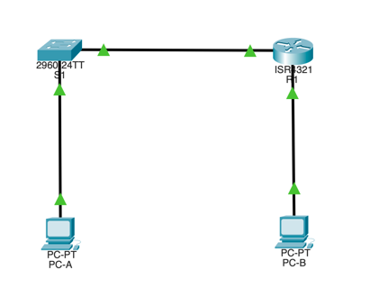
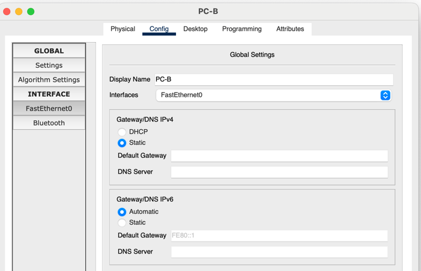
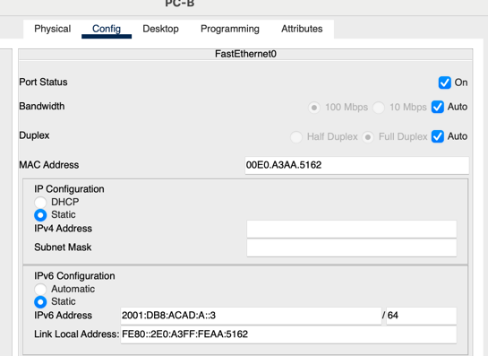
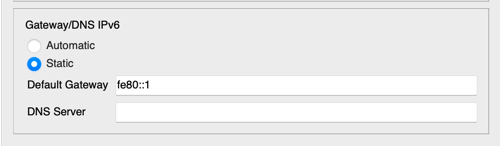

# Домашняя работа #3

> Предварительно я выполнил шаги с установкой dual-ipv4-and-ipv6 в качестве шаблона SDM по умолчанию.
> Дополнительно обозначу что я использовал не маршрутизатор 4221, а 4321. Возможно в домашней работе опечатка, так как 4221 у меня в интерфейсе PT нет.

## I. Настройка топологии и конфигурация основных параметров маршрутизатора и коммутатора


> Выполнены предварительные настройки и активированы интерфейсы для роутера. В случае свитча - самостоятельно активировать ничего не потребовалось.

## II. Ручная настройка IPv6-адресов
### 1. Ручная настройка IPv6-адресов

**a. Назначьте глобальные индивидуальные IPv6-адреса, указанные в таблице адресации обоим интерфейсам Ethernet на R1.**

**b. Введите команду show ipv6 interface brief, чтобы проверить, назначен ли каждому интерфейсу корректный индивидуальный IPv6-адрес.**

```bash
R1#show ipv6 int brief
GigabitEthernet0/0/0       [up/up]
    FE80::205:5EFF:FE00:BD01
    2001:DB8:ACAD:A::1
GigabitEthernet0/0/1       [up/up]
    FE80::205:5EFF:FE00:BD02
    2001:DB8:ACAD:1::1
Vlan1                      [administratively down/down]
    unassigned
```

**c. Чтобы обеспечить соответствие локальных адресов канала индивидуальному адресу, вручную введите локальные адреса канала на каждом интерфейсе Ethernet на R1**

**d. Используйте выбранную команду, чтобы убедиться, что локальный адрес связи изменен на fe80::1.**

```bash
R1#show ipv6 int brief
GigabitEthernet0/0/0       [up/up]
    FE80::1
    2001:DB8:ACAD:A::1
GigabitEthernet0/0/1       [up/up]
    FE80::1
    2001:DB8:ACAD:1::1
Vlan1                      [administratively down/down]
    unassigned
```

**d. Какие группы многоадресной рассылки назначены интерфейсу G0/0?**

> Назначены группы мультикаст-рассылки FF02::1 и FF02::1:FF00:1. Как мы видим, группа FF02::2 не активирована, соответственно роутер пока не может нормально функционировать в IPv6 конфигурации.
```bash
R1#sh ipv6 int g0/0/0
GigabitEthernet0/0/0 is up, line protocol is up
  ...
  Global unicast address(es):
    2001:DB8:ACAD:A::1, subnet is 2001:DB8:ACAD:A::/64
  Joined group address(es):
    FF02::1
    FF02::1:FF00:1
  ...
```

### 2. Активируйте IPv6-маршрутизацию на R1.

**a. В командной строке на PC-B введите команду ipconfig, чтобы получить данные IPv6-адреса, назначенного интерфейсу ПК.**

Вопрос: Назначен ли индивидуальный IPv6-адрес сетевой интерфейсной карте (NIC) на PC-B?

> Нет, GUA адреса у данного устройства нет, есть только link-local адрес. 

```bash
C:\>ipconfig

FastEthernet0 Connection:(default port)

   Connection-specific DNS Suffix..: 
   Link-local IPv6 Address.........: FE80::2E0:A3FF:FEAA:5162
   IPv6 Address....................: ::
   IPv4 Address....................: 0.0.0.0
   Subnet Mask.....................: 0.0.0.0
   Default Gateway.................: ::
                                     0.0.0.0
```

**b. Активируйте IPv6-маршрутизацию на R1 с помощью команды IPv6 unicast-routing.**

> Активировал unicast-routing и сразу проверил что роутер начал слушать группу FF02::2, как видно - действительно начал. 

```bash
R1(config)#ipv6 unicast-routing
R1(config)#exit
R1#
%SYS-5-CONFIG_I: Configured from console by console

R1#sh ipv6 int g0/0/0
GigabitEthernet0/0/0 is up, line protocol is up
  ...
  Global unicast address(es):
    2001:DB8:ACAD:A::1, subnet is 2001:DB8:ACAD:A::/64
  Joined group address(es):
    FF02::1
    **FF02::2**
    FF02::1:FF00:1
  ...
```

**c. Теперь, когда R1 входит в группу многоадресной рассылки всех маршрутизаторов, еще раз введите команду ipconfig на PC-B. Проверьте данные IPv6-адреса.**
> У меня получилось не сразу, а только после того как выставил параметр ipv6/gateway в automatic (на скриншоте). Такое ощущение что не связано, но вдруг.
 

```bash
C:\>ipconfig

FastEthernet0 Connection:(default port)

   Connection-specific DNS Suffix..: 
   Link-local IPv6 Address.........: FE80::2E0:A3FF:FEAA:5162
   IPv6 Address....................: 2001:DB8:ACAD:1:2E0:A3FF:FEAA:5162
   IPv4 Address....................: 0.0.0.0
   Subnet Mask.....................: 0.0.0.0
   Default Gateway.................: FE80::1
                                     0.0.0.0
```

Почему PC-B получил глобальный префикс маршрутизации и идентификатор подсети, которые вы настроили на R1?

> Компьютер (если ничего не путают) использовал SLAAC для назначения IPv6 адреса. По этому протоколу - первые 4 хекстета прилетают от роутера, и они какбы задают нам подсеть где находится устройство (приходят из RA сообщения). Оставшиеся хекстеты относятся а адресу интерфейса и в данном случае были сгенерены через EUI-64.

### 3. Назначьте IPv6-адреса интерфейсу управления (SVI) на S1.

**a. Назначьте адрес IPv6 для S1. Также назначьте этому интерфейсу локальный адрес канала fe80::b.**

```bash
S1(config)#int vlan1
S1(config-if)#ipv6 add 2001:db8:acad:1::b
% Incomplete command.
S1(config-if)#ipv6 add 2001:db8:acad:1::b/64
S1(config-if)#ipv6 add fe80::b link-local
S1(config-if)#no shut
```

**b. Назначьте адрес IPv6 для S1. Также назначьте этому интерфейсу локальный адрес канала fe80::b.**

```bash
S1#show ipv6 int vlan 1
Vlan1 is up, line protocol is up
  IPv6 is enabled, link-local address is FE80::B
  No Virtual link-local address(es):
  Global unicast address(es):
    2001:DB8:ACAD:1::B, subnet is 2001:DB8:ACAD:1::/64
  Joined group address(es):
    FF02::1
    FF02::1:FF00:B
  MTU is 1500 bytes
  ICMP error messages limited to one every 100 milliseconds
  ICMP redirects are enabled
  ICMP unreachables are sent
  Output features: Check hwidb
  ND DAD is enabled, number of DAD attempts: 1
  ND reachable time is 30000 milliseconds
```

### 4. Назначьте компьютерам статические IPv6-адреса.

**a. Откройте окно Свойства Ethernet для каждого ПК и назначьте адресацию IPv6.**

> Выставил статические IP адреса



> Прописал дефолтный гейтвей 



> Вот такое выдает ipconfig на PC-A
```bash
C:\>ipconfig

FastEthernet0 Connection:(default port)

   Connection-specific DNS Suffix..: 
   Link-local IPv6 Address.........: FE80::2E0:B0FF:FE01:A517
   IPv6 Address....................: 2001:DB8:ACAD:1::3
   IPv4 Address....................: 0.0.0.0
   Subnet Mask.....................: 0.0.0.0
   Default Gateway.................: ::
                                     0.0.0.0
```

> Вот такое выдает ipconfig на PC-B
```bash
C:\>ipconfig

FastEthernet0 Connection:(default port)

   Connection-specific DNS Suffix..: 
   Link-local IPv6 Address.........: FE80::2E0:A3FF:FEAA:5162
   IPv6 Address....................: 2001:DB8:ACAD:A::3
   IPv4 Address....................: 0.0.0.0
   Subnet Mask.....................: 0.0.0.0
   Default Gateway.................: ::
                                     0.0.0.0
```

**b. Убедитесь, что оба компьютера имеют правильную информацию адреса IPv6. Каждый компьютер должен иметь два глобальных адреса IPv6: один статический и один SLACC.**

> **Тут я по правде говоря не понял как выставить для PC SLAAC GUA адрес поверх статического. Ну то есть, как сделать либо то, либо другое - понятно, а как сделать и то и другое - нет. Если речь про link-local адрес, то я не понял при чем тут SLAAC, вроде бы он никак не связан с LLA :(**

# III. Проверка сквозного подключения

С PC-A отправьте эхо-запрос на FE80::1. Это локальный адрес канала, назначенный G0/1 на R1.

```bash
C:\>ping FE80::1

Pinging FE80::1 with 32 bytes of data:

Reply from FE80::1: bytes=32 time<1ms TTL=255
Reply from FE80::1: bytes=32 time<1ms TTL=255
Reply from FE80::1: bytes=32 time<1ms TTL=255
```

Отправьте эхо-запрос на интерфейс управления S1 с PC-A.

```bash
C:\>ping 2001:db8:acad:1::b

Pinging 2001:db8:acad:1::b with 32 bytes of data:

Reply from 2001:DB8:ACAD:1::B: bytes=32 time<1ms TTL=255
Reply from 2001:DB8:ACAD:1::B: bytes=32 time<1ms TTL=255
```

Введите команду tracert на PC-A, чтобы проверить наличие сквозного подключения к PC-B.

> Вот тут мне пришлось минут 20 повозиться, сходу не завелось, подергал кабели, поребутал роутер и свитч, еще в процессе обнаружил что слетели группы мультикаст-рассылки у роутера... Но вроде бы в конечном счете получилось :)

```bash
C:\>tracert 2001:db8:acad:a::3

Tracing route to 2001:db8:acad:a::3 over a maximum of 30 hops: 

  1   0 ms      1 ms      0 ms      2001:DB8:ACAD:1::1
  2   0 ms      0 ms      0 ms      2001:DB8:ACAD:A::3

Trace complete.
```

С PC-B отправьте эхо-запрос на PC-A.

```bash
C:\>ping 2001:db8:acad:1::3

Pinging 2001:db8:acad:1::3 with 32 bytes of data:

Reply from 2001:DB8:ACAD:1::3: bytes=32 time=22ms TTL=127
Reply from 2001:DB8:ACAD:1::3: bytes=32 time<1ms TTL=127
Reply from 2001:DB8:ACAD:1::3: bytes=32 time<1ms TTL=127
Reply from 2001:DB8:ACAD:1::3: bytes=32 time<1ms TTL=127

Ping statistics for 2001:DB8:ACAD:1::3:
    Packets: Sent = 4, Received = 4, Lost = 0 (0% loss),
Approximate round trip times in milli-seconds:
    Minimum = 0ms, Maximum = 22ms, Average = 5ms
```

С PC-B отправьте эхо-запрос на локальный адрес канала G0/0 на R1.

```bash
C:\>ping fe80::1

Pinging fe80::1 with 32 bytes of data:

Reply from FE80::1: bytes=32 time<1ms TTL=255
Reply from FE80::1: bytes=32 time<1ms TTL=255
Reply from FE80::1: bytes=32 time<1ms TTL=255
Reply from FE80::1: bytes=32 time<1ms TTL=255

Ping statistics for FE80::1:
    Packets: Sent = 4, Received = 4, Lost = 0 (0% loss),
Approximate round trip times in milli-seconds:
    Minimum = 0ms, Maximum = 0ms, Average = 0ms
```

# Вопросы
Почему обоим интерфейсам Ethernet на R1 можно назначить один и тот же локальный адрес канала — FE80::1?
> Потому что они находятся в разных подсетях.

Какой идентификатор подсети в индивидуальном IPv6-адресе 2001:db8:acad::aaaa:1234/64?
> Если ничего не путаю, 0000.