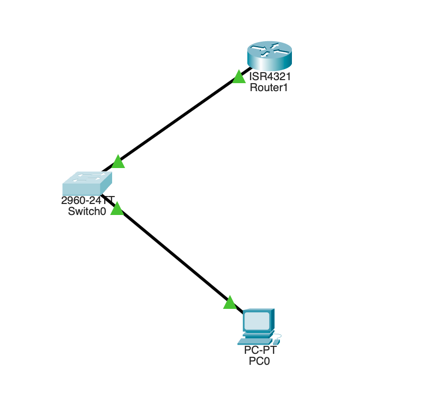

# Домашняя работа #2

## I. Настройка основных параметров устройств

> Задание по сути дублирует первую домашнюю работу, вместо подробного описания, я приложу конфигурации роутера и свитче. Далее приведена топология.



> Конфигурация свитча
```bash
S1#show run
Building configuration...

Current configuration : 1319 bytes
!
version 15.0
no service timestamps log datetime msec
no service timestamps debug datetime msec
service password-encryption
!
hostname S1
!
enable secret 5 $1$mERr$9cTjUIEqNGurQiFU.ZeCi1
enable password 7 0822455D0A16
!
!
no ip domain-lookup
!
!
!
spanning-tree mode pvst
spanning-tree extend system-id
!
interface FastEthernet0/1
...
interface Vlan1
 ip address 192.168.1.11 255.255.255.0
!
banner motd ^C
Unauthorized access is strictly prohibited. ^C
!
!
!
line con 0
 password 7 0822455D0A16
 logging synchronous
 login
!
line vty 0 4
 password 7 0822455D0A16
 login
line vty 5 15
 password 7 0822455D0A16
 login
!
!
!
!
end
```

> Конфигурация роутера
```bash
Building configuration...

Current configuration : 754 bytes
!
version 15.4
no service timestamps log datetime msec
no service timestamps debug datetime msec
service password-encryption
!
hostname R1
!
!
!
enable secret 5 $1$mERr$9cTjUIEqNGurQiFU.ZeCi1
enable password 7 0822455D0A16
!
!
!
!
!
!
ip cef
no ipv6 cef
!
!
!
!
!
!
!
!
!
!
no ip domain-lookup
!
!
spanning-tree mode pvst
!
!
!
!
!
!
interface GigabitEthernet0/0/0
 no ip address
 duplex auto
 speed auto
 shutdown
!
interface GigabitEthernet0/0/1
 ip address 192.168.1.1 255.255.255.0
 duplex auto
 speed auto
!
interface Vlan1
 no ip address
 shutdown
!
ip classless
!
ip flow-export version 9
!
!
!
banner motd ^C
Unauthorized access is strictly prohibited. ^C
!
!
!
!
!
line con 0
!
line aux 0
!
line vty 0 4
 password 7 0822455D0A16
 login
!
!
!
end

```

> Пинг с PC до свитча
```bash
C:\>ping 192.168.1.11

Pinging 192.168.1.11 with 32 bytes of data:

Request timed out.
Reply from 192.168.1.11: bytes=32 time<1ms TTL=255
Reply from 192.168.1.11: bytes=32 time<1ms TTL=255
Reply from 192.168.1.11: bytes=32 time<1ms TTL=255

Ping statistics for 192.168.1.11:
    Packets: Sent = 4, Received = 3, Lost = 1 (25% loss),
Approximate round trip times in milli-seconds:
    Minimum = 0ms, Maximum = 0ms, Average = 0ms
```


> Пинг с PC до роутера
```bash
C:\>ping 192.168.1.1

Pinging 192.168.1.1 with 32 bytes of data:

Reply from 192.168.1.1: bytes=32 time<1ms TTL=255
Reply from 192.168.1.1: bytes=32 time<1ms TTL=255
Reply from 192.168.1.1: bytes=32 time<1ms TTL=255
Reply from 192.168.1.1: bytes=32 time<1ms TTL=255

Ping statistics for 192.168.1.1:
    Packets: Sent = 4, Received = 4, Lost = 0 (0% loss),
Approximate round trip times in milli-seconds:
    Minimum = 0ms, Maximum = 0ms, Average = 0ms
```

## II. Настройка маршрутизатора **[и коммутатора]** для доступа по протоколу SSH

> Я в рамках второй части настрою **и свитч и роутер**, чтобы не дублировать текст.

### 1. Настройте аутентификацию устройств.

> На свитче
```bash
S1(config)#ip domain-name kek.ru
S1(config)#hostname S1
```

> На роутере
```bash
R1(config)#ip domain-name kek.ru
R1(config)#hostname R1
```

### 2. Создайте ключ шифрования с указанием его длины.

> На свитче 
```bash
S1(config)#crypto key generate rsa
The name for the keys will be: S1.kek.ru
Choose the size of the key modulus in the range of 360 to 2048 for your
  General Purpose Keys. Choosing a key modulus greater than 512 may take
  a few minutes.

How many bits in the modulus [512]: 2048
% Generating 2048 bit RSA keys, keys will be non-exportable...[OK]
```

> На роутере
```bash
R1(config)#crypto key generate rsa
The name for the keys will be: R1.kek.ru
Choose the size of the key modulus in the range of 360 to 2048 for your
  General Purpose Keys. Choosing a key modulus greater than 512 may take
  a few minutes.

How many bits in the modulus [512]: 2048
% Generating 2048 bit RSA keys, keys will be non-exportable...[OK]
```

### 3. Создайте имя пользователя в локальной базе учетных записей.
```bash
S1(config)#username admin privilege 15 secret Adm1nP@55
```

```bash
R1(config)#username admin privilege 15 secret Adm1nP@55
```

### 4. Активируйте протокол SSH на линиях VTY.
```bash
R1(config)#line vty 0 4
R1(config-line)#login local // используем локальную базу данных
R1(config-line)#transport input ssh // активируем протокол SSh
R1(config-line)#end
```

```bash
S1(config)#line vty 0 4
S1(config-line)#login local
S1(config-line)#transport input ssh
S1(config-line)#end
```

### 5. Сохраните текущую конфигурацию в загрузочном файле

> Сохранил через w m.

### 6. Установите соединение с маршрутизатором по протоколу SSH.

> Подключаемся к роутеру 
```bash
C:\>ssh -l admin 192.168.1.1
Password: 
Unauthorized access is strictly prohibited. 
R1#
```

> Подключаемся к свитчу
```bash
C:\>ssh -l admin 192.168.1.11
Password: 
Unauthorized access is strictly prohibited. 
S1#
```

## IV. Настройка протокола SSH с использованием интерфейса командной строки (CLI) коммутатора

### 2. Установите с коммутатора S1 соединение с маршрутизатором R1 по протоколу SSH.

> Полная последовательность действий
```bash
S1#ssh -l admin 192.168.1.1
Password: 
Unauthorized access is strictly prohibited. 
R1#" 
S1#
S1#
[Resuming connection 1 to 192.168.1.1 ... ]

Translating " "
% Unknown command or computer name, or unable to find computer address

R1#exit

[Connection to 192.168.1.1 closed by foreign host]
S1#
```

Какие версии протокола SSH поддерживаются при использовании интерфейса командной строки?

> На лекции мы обсуждали, что версии 1 и 2, где 2 - на текущий момент безопасная, а 1 имеет уязвимости. В домашней работе я использовал 1-ю. 

> Поменять версию можно через команду `ip ssh v 2`. 

# Вопрос для повторения
Как предоставить доступ к сетевому устройству нескольким пользователям, у каждого из которых есть собственное имя пользователя?

> Я полагаю, что нужно для каждого пользователя сгенерировать отдельного юзера с собственным паролем.