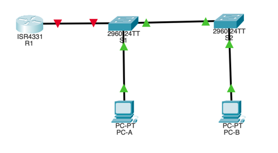
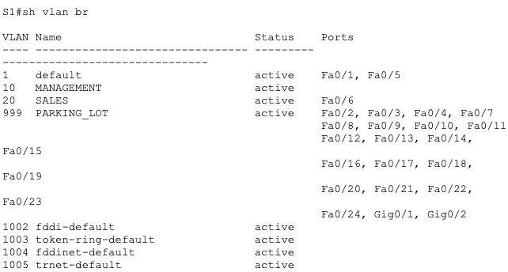
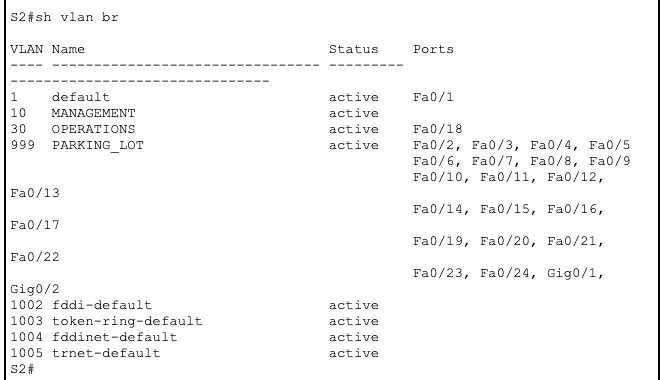
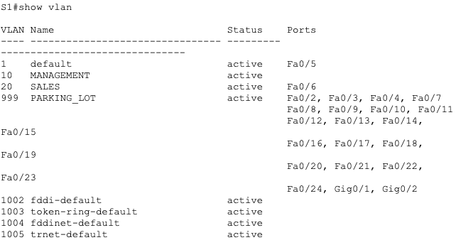
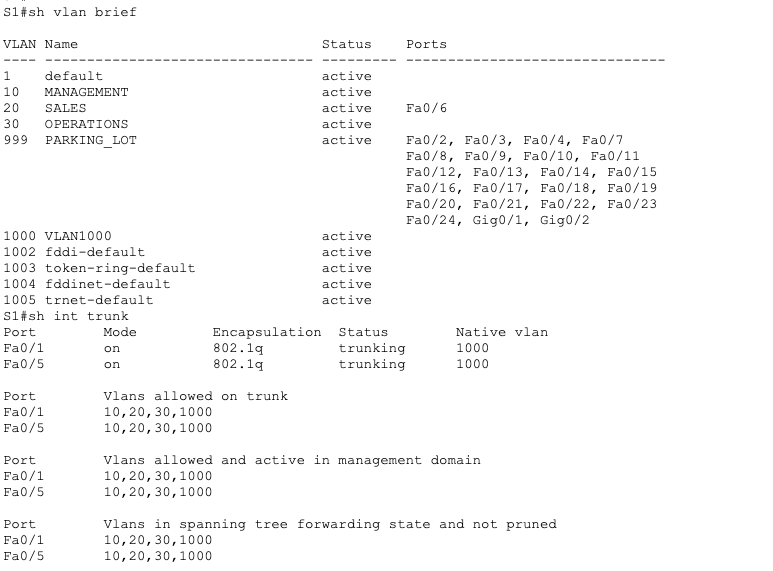
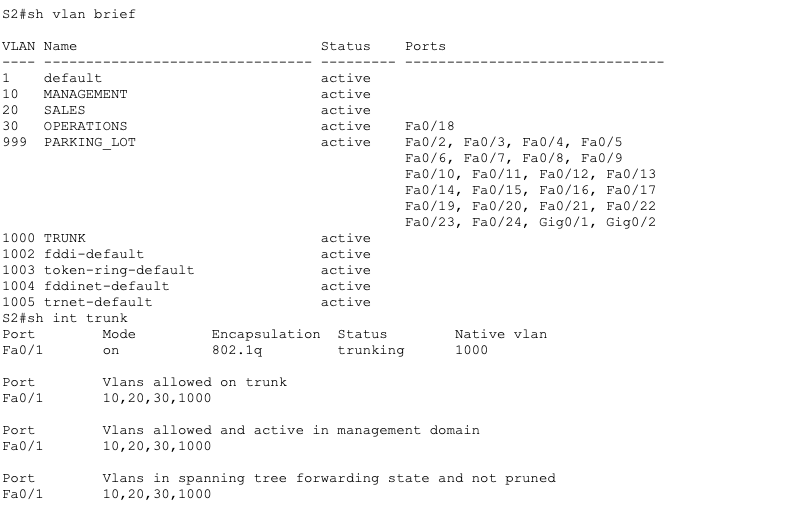

# Домашняя работа #5

## I. Создание сети и настройка основных параметров устройства
### 1. Настройте сеть согласно топологии


### 2. Настройте базовые параметры для маршрутизатора.

```bash
R1(config)#no ip domain-lookup
R1(config)#service password-encryption
R1(config)#enable secret class
R1(config)#line con 0
R1(config-line)#password cisco
R1(config-line)#login
R1(config-line)#logging sync
R1(config-line)#exit
R1(config)#line vty 0 15
R1(config-line)#password cisco
R1(config-line)#login
R1(config-line)#logging sync
R1(config-line)#exit
R1(config)#exit
R1#clock set 21:30:00 21 September 2025
```

### 3. Настройте базовые параметры каждого коммутатора.
> Аналогично

### 4. Настройте узлы ПК.

```bash
FastEthernet0 Connection:(default port)

   Connection-specific DNS Suffix..: 
   Link-local IPv6 Address.........: FE80::2D0:FFFF:FEBB:BD0E
   IPv6 Address....................: ::
   IPv4 Address....................: 192.168.20.3
   Subnet Mask.....................: 255.255.255.0
   Default Gateway.................: ::
                                     192.168.20.1
```

```bash
FastEthernet0 Connection:(default port)

   Connection-specific DNS Suffix..: 
   Link-local IPv6 Address.........: FE80::250:FFF:FE2C:30DB
   IPv6 Address....................: ::
   IPv4 Address....................: 192.168.30.3
   Subnet Mask.....................: 255.255.255.0
   Default Gateway.................: ::
                                     192.168.30.1
```

## II. Создание сетей VLAN и назначение портов коммутатора
### 1. Создайте сети VLAN на коммутаторах.

**a. Создайте и назовите необходимые VLAN на каждом коммутаторе из таблицы выше.**

> Создание VLAN на примере vlan 30 для S2
```bash
S2#conf term
S2(config)#vlan 30
S2(config-vlan)#name OPERATIONS
S2(config-vlan)#end
```

> VLAN на S2
```bash
10   MANAGEMENT                       active    
30   OPERATIONS                       active    
999  PARKING_LOT                      active    
1002 fddi-default                     active    
1003 token-ring-default               active    
1004 fddinet-default                  active    
1005 trnet-default                    active  
```

> VLAN на S1
```bash
10   MANAGEMENT                       active    
20   SALES                            active    
999  PARKING_LOT                      active    
1002 fddi-default                     active    
1003 token-ring-default               active    
1004 fddinet-default                  active    
1005 trnet-default                    active 
```

**b. Настройте интерфейс управления и шлюз по умолчанию на каждом коммутаторе, используя информацию об IP-адресе в таблице адресации.**
> На примере S1
```bash
S1(config)#ip default-gateway 192.168.10.1
S1(config)#int vlan 10
S1(config-if)#ip address 192.168.10.11 255.255.255.0
S1(config-if)#no shut
S1(config-if)#end
S1(config)#int f0/6
S1(config-if)#switchport mode access
S1(config-if)#sw ac vlan 20
S1(config-if)#end
```

> Вланы S1
```bash
10   MANAGEMENT                       active    
20   SALES                            active    Fa0/6
999  PARKING_LOT                      active

...


Vlan1                  unassigned      YES manual administratively down down 
Vlan10                 192.168.10.11   YES manual up                    down
```


> Вланы S2
```bash
10   MANAGEMENT                       active    
30   OPERATIONS                       active    Fa0/18
999  PARKING_LOT                      active 

...

Vlan1                  unassigned      YES manual administratively down down 
Vlan10                 192.168.10.12   YES manual up                    down
```

**c. Назначьте все неиспользуемые порты коммутатора VLAN Parking_Lot, настройте их для статического режима доступа и административно деактивируйте их.**
> Выделяю только интерфейсы указанные в таблице! Далее для S1
```bash
S1(config)#int range f0/2-4,f0/7-24,g0/1-2
S1(config-if-range)#sw m a
S1(config-if-range)#sw acc vlan 999
S1(config-if-range)#end
```


> И еще дальше для S2
```bash
S2(config)#int range F0/2-17, F0/19-24, G0/1-2
S2(config-if-range)#sw m a
S2(config-if-range)#sw acc vlan 999
S2(config-if-range)#end
```



## II. Конфигурация магистрального канала стандарта 802.1Q между коммутаторами
### 1. Вручную настройте магистральный интерфейс F0/1 на коммутаторах S1 и S2.
```bash
S2(config)#int f0/1
S2(config-if)#sw m trunk
%LINEPROTO-5-UPDOWN: Line protocol on Interface Vlan10, changed state to up
S2(config-if)#sw tr native vlan 1000
S2(config-if)#
%CDP-4-NATIVE_VLAN_MISMATCH: Native VLAN mismatch discovered on FastEthernet0/1 (1000), with S1 FastEthernet0/1 (1).
S2(config-if)#sw tr allowed vlan 10,20,30,1000
S2(config-if)#sw nonegotiate 
S2(config-if)#end
```
> S1
```bash
S1#sh in trunk
Port        Mode         Encapsulation  Status        Native vlan
Fa0/1       on           802.1q         trunking      1000

Port        Vlans allowed on trunk
Fa0/1       10,20,30,1000

Port        Vlans allowed and active in management domain
Fa0/1       10,20

Port        Vlans in spanning tree forwarding state and not pruned
Fa0/1       none
```
>S2
```bash
Port        Mode         Encapsulation  Status        Native vlan
Fa0/1       on           802.1q         trunking      1000

Port        Vlans allowed on trunk
Fa0/1       10,20,30,1000

Port        Vlans allowed and active in management domain
Fa0/1       10,30

Port        Vlans in spanning tree forwarding state and not pruned
Fa0/1       10,30
```
> По какой-то причине в разделе "Vlans in spanning tree forwarding state and not pruned" для S1 не было 10, 20 вланов, добавил их с помощью команды (подсказал ChatGPT).

> UPD: Ближе к концу ДЗ я разобрался с проблемой - нужно было создать все VLAN на всех свитчах. 


### 2. Вручную настройте магистральный интерфейс F0/5 на коммутаторе S1.
> Сделал аналогичные шаги для интерфейса f0/5 на S1, однако данный интерфейс почему-то все еще отображается как будто он принадлежит к vlan 1. Далее вырезка из running config'a.

```bash
interface FastEthernet0/5
 switchport trunk native vlan 1000
 switchport trunk allowed vlan 10,20,30,1000
 switchport mode trunk
 switchport nonegotiate
```
> И скриншот из show vlan


Что произойдет, если G0/0/1 на R1 будет отключен?
> Если ничего не путаю, подсоединенные PC из разных VLAN не смогут друг до друга достучаться. Коммутаторы не будут пересылать фреймы с тегами от разных VLAN'ов. Чтобы связность появилась - нужен роутер с настроенными access листами.

## IV. Настройка маршрутизации между сетями VLAN
> Пример настройки

```bash
R1(config)#int g0/0/1.30
R1(config-subif)#
%LINK-5-CHANGED: Interface GigabitEthernet0/0/1.30, changed state to up
%LINEPROTO-5-UPDOWN: Line protocol on Interface GigabitEthernet0/0/1.30, changed state to up
R1(config-subif)#encapsulation dot1Q 30
R1(config-subif)#ip add 192.168.30.1 255.255.255.0
R1(config-subif)#exit
# ```

> Финальная конфигурация
```bash
interface GigabitEthernet0/0/0
 no ip address
 duplex auto
 speed auto
 shutdown
!
interface GigabitEthernet0/0/1
 no ip address
 duplex auto
 speed auto
!
interface GigabitEthernet0/0/1.10
 encapsulation dot1Q 10
 ip address 192.168.10.1 255.255.255.0
!
interface GigabitEthernet0/0/1.20
 encapsulation dot1Q 20
 ip address 192.168.20.1 255.255.255.0
!
interface GigabitEthernet0/0/1.30
 encapsulation dot1Q 30
 ip address 192.168.30.1 255.255.255.0
!
interface GigabitEthernet0/0/1.1000
 encapsulation dot1Q 1000 native
 no ip address
!
```

```bash
Interface              IP-Address      OK? Method Status                Protocol 
GigabitEthernet0/0/0   unassigned      YES unset  administratively down down 
GigabitEthernet0/0/1   unassigned      YES unset  up                    up 
GigabitEthernet0/0/1.10192.168.10.1    YES manual up                    up 
GigabitEthernet0/0/1.20192.168.20.1    YES manual up                    up 
GigabitEthernet0/0/1.30192.168.30.1    YES manual up                    up 
GigabitEthernet0/0/1.1000unassigned      YES unset  up                    up 
GigabitEthernet0/0/2   unassigned      YES unset  administratively down down 
Vlan1                  unassigned      YES unset  administratively down down
```

## V. Проверьте, работает ли маршрутизация между VLAN
> Далее я убедился что маршрутизация не работает. Компы не пингуются. В процессе траблшутинга с ChatGPT я понял - что нужно было создать VLAN 20,30 и на S1 и на S2. 
> Проблема видимо была в том что свитчи не понимали что за тег такой (для них влан был неизвестен) и просто дропали фреймы.

> Далее указаны скрины рабочих конфигураций VLAN для S1

> И для S2
 


> Далее код пинга PC-A и PC-B как самый узкий момент.
```bash
C:\>ping 192.168.30.3

Pinging 192.168.30.3 with 32 bytes of data:

Request timed out.
Reply from 192.168.30.3: bytes=32 time<1ms TTL=127
Reply from 192.168.30.3: bytes=32 time<1ms TTL=127

Ping statistics for 192.168.30.3:
    Packets: Sent = 3, Received = 2, Lost = 1 (34% loss),
Approximate round trip times in milli-seconds:
    Minimum = 0ms, Maximum = 0ms, Average = 0ms
```

```bash
C:\>ping 192.168.20.3

Pinging 192.168.20.3 with 32 bytes of data:

Reply from 192.168.20.3: bytes=32 time<1ms TTL=127
Reply from 192.168.20.3: bytes=32 time<1ms TTL=127
Reply from 192.168.20.3: bytes=32 time<1ms TTL=127
Reply from 192.168.20.3: bytes=32 time<1ms TTL=127

Ping statistics for 192.168.20.3:
    Packets: Sent = 4, Received = 4, Lost = 0 (0% loss),
Approximate round trip times in milli-seconds:
    Minimum = 0ms, Maximum = 0ms, Average = 0ms
```

> С PC-A S2 сходу не пинговался, но потом начал пинговаться (я ничего не делал, просто попроверял конфигурации).
```bash
Pinging 192.168.10.12 with 32 bytes of data:

Request timed out.
Reply from 192.168.10.12: bytes=32 time<1ms TTL=254
Reply from 192.168.10.12: bytes=32 time<1ms TTL=254
Reply from 192.168.10.12: bytes=32 time<1ms TTL=254

Ping statistics for 192.168.10.12:
    Packets: Sent = 4, Received = 3, Lost = 1 (25% loss),
Approximate round trip times in milli-seconds:
    Minimum = 0ms, Maximum = 0ms, Average = 0ms
```

> Трейс с PC-B до PC-A

```bash
C:\>tracert 192.168.20.3
Tracing route to 192.168.20.3 over a maximum of 30 hops: 
  1   0 ms      0 ms      0 ms      192.168.30.1
  2   0 ms      0 ms      0 ms      192.168.20.3
Trace complete.
```