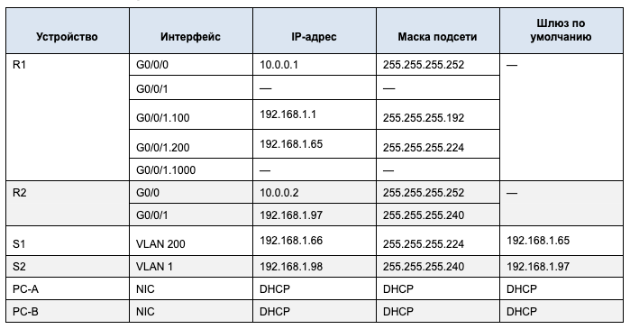
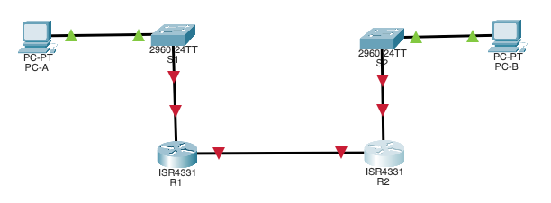
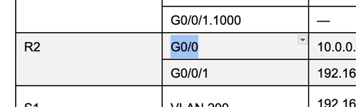
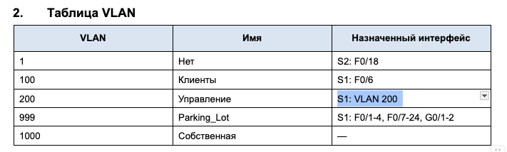

### Домашняя работа 7 DHCP-4
## I. Создание сети и настройка основных параметров устройства

### 1. Создание схемы адресации

> Подсеть A: 192.168.1.0/26 255.255.255.192 (на 62 хоста)

> Подсеть B: 192.168.1.64/27 255.255.255.224 (на 30 хостов)

> Подсеть C: 192.168.1.96/28 255.255.255.240 (на 14 хостов)



### 2. Создайте сеть согласно топологии



### 3. Произведите базовую настройку маршрутизаторов.
> Здесь типовая настройка, добавлю только информацию по установке времени

```bash
R1#clock set 19:43:00 nov 16 2025
R1#show clock
19:43:10.193 UTC Sun Nov 16 2025
```

### 4. Настройка маршрутизации между сетями VLAN на маршрутизаторе R1

a. Активируйте интерфейс G0/0/1 на маршрутизаторе.
```bash
R1(config)#int g0/0/1
R1(config-if)#no shut
```

b. Настройте подинтерфейсы для каждой VLAN в соответствии с требованиями таблицы IP-адресации. Все субинтерфейсы используют инкапсуляцию 802.1Q и назначаются первый полезный адрес из вычисленного пула IP-адресов. Убедитесь, что подинтерфейсу для native VLAN не назначен IP-адрес. Включите описание для каждого подинтерфейса.
> Я добавлю комментарий, что данный пункт домашнего задания мне не очень понятен, как будто некоторые вещи не оговорены. У нас нету в таблице адресации явного маппинга субинтерфейсов на VLAN, только интуитивно кажется что последняя компонента номера интерфейса отвечает за номер VLAN. Я бы данный момент уточнил в задании, так как этот пункт находится в самом начале и очень жалко было бы переделывать в самом конце, если там станет очевидно что в самом начале конфигурация была выполнена не верно. =(
```bash
R1(config)#interface g0/0/1.100
R1(config-subif)#encapsulation dot1Q 100
R1(config-subif)#ip address 192.168.1.1 255.255.255.192
R1(config-subif)#description CLIENTS
```

```bash
R1(config)#int g0/0/1.200
R1(config-subif)#encapsulation dot1Q 200
R1(config-subif)#ip address 192.168.1.65 255.255.255.224
R1(config-subif)#description MANAGEMENT
```

> Далее по описанию я не понял что у нас за интерфейс для нативного VLAN, но по контексту кажется что это 1000. Пожалуйста, прописывайте более явно :(
```bash
R1(config)#int g0/0/1.1000
R1(config-subif)#encapsulation dot1Q 1000 native
R1(config-subif)#no ip address
R1(config-subif)#description NATIVE VLAN
```

> Дополнительно поднял G0/0/0, хотя этого в задании нет. Просто в таблице адресации для него указан айпишник...
```bash
R1(config)#int g0/0/0
R1(config-if)#ip addr 10.0.0.1 255.255.255.252
R1(config-if)#no shut
R1(config-if)#end
```

c. Убедитесь, что вспомогательные интерфейсы работают.
> Получаем вот такую картину.
```bash
R1#show ip interface brief
Interface                 IP-Address      OK? Method Status                Protocol 
GigabitEthernet0/0/0      10.0.0.1        YES manual up                    down 
GigabitEthernet0/0/1      unassigned      YES unset  up                    up 
GigabitEthernet0/0/1.100  192.168.1.1     YES manual up                    up 
GigabitEthernet0/0/1.200  192.168.1.65    YES manual up                    up 
GigabitEthernet0/0/1.1000 unassigned      YES unset  up                    up 
GigabitEthernet0/0/2      unassigned      YES unset  administratively down down 
Vlan1                     unassigned      YES unset  administratively down down
```

### 5. Настройте G0/1 на R2, затем G0/0/0 и статическую маршрутизацию для обоих маршрутизаторов
a. Настройте G0/0/1 на R2 с первым IP-адресом подсети C, рассчитанным ранее.

```bash
R2(config)#int g0/0/1
R2(config-if)#ip addr 192.168.1.97 255.255.255.240
R2(config-if)#no shut
R2(config-if)#exit
```

b. Настройте интерфейс G0/0/0 для каждого маршрутизатора на основе приведенной выше таблицы IP-адресации.
> Я ранее настроил для R1. Тут еще у вас очепятка, на скрине кажется должно быть G0/0/0.


```bash
R2(config)#int g0/0/0
R2(config-if)#ip addr 10.0.0.2 255.255.255.252
R2(config-if)#no shut
```

c. Настройте маршрут по умолчанию на каждом маршрутизаторе, указываемом на IP-адрес G0/0/0 на другом маршрутизаторе.
```bash
R1(config)#ip route 0.0.0.0 0.0.0.0 10.0.0.2
```
```bash
R2(config)#ip route 0.0.0.0 0.0.0.0 10.0.0.1
```

c. Убедитесь, что статическая маршрутизация работает с помощью пинга до адреса G0/0/1 R2 от R1.
> Пинг успешно прошел
```bash
R1#ping 192.168.1.97

Type escape sequence to abort.
Sending 5, 100-byte ICMP Echos to 192.168.1.97, timeout is 2 seconds:
.!!!!
Success rate is 80 percent (4/5), round-trip min/avg/max = 0/0/0 ms
```

> Дополнительно укажу результат вывода show ip interface brief для R2
```bash
R2#show ip interface brief
Interface              IP-Address      OK? Method Status                Protocol 
GigabitEthernet0/0/0   10.0.0.2        YES manual up                    up 
GigabitEthernet0/0/1   192.168.1.97    YES manual up                    up 
GigabitEthernet0/0/2   unassigned      YES unset  administratively down down 
Vlan1                  unassigned      YES unset  administratively down down
```

### 6. Настройте базовые параметры каждого коммутатора.
> Шаги аналогичны тем что выполнялись для роутеров, поэтому отписывать их не буду чтобы не загружать отчет

### 7. Создайте сети VLAN на коммутаторе S1.
a. Создайте необходимые VLAN на коммутаторе 1 и присвойте им имена из приведенной выше таблицы.
```bash
S1(config)#vlan 100
S1(config-vlan)#name CLIENTS
S1(config-vlan)#vlan 200
S1(config-vlan)#name MANAGEMENT
S1(config-vlan)#vlan 999
S1(config-vlan)#name PARKING_LOT
S1(config-vlan)#vlan 1000
S1(config-vlan)#name PRIVATE
```

b. Настройте и активируйте интерфейс управления на S1 (VLAN 200), используя второй IP-адрес из подсети, рассчитанный ранее. Кроме того установите шлюз по умолчанию на S1.
```bash
S1(config)#int vlan 200
S1(config-if)#ip address 192.168.1.66 255.255.255.224
S1(config-if)#no shut
S1(config-if)#exit
S1(config)#ip default-gateway 192.168.1.65
```

c. Настройте и активируйте интерфейс управления на S2 (VLAN 1), используя второй IP-адрес из подсети, рассчитанный ранее. Кроме того, установите шлюз по умолчанию на S2
```bash
S2(config)#int vlan 1
S2(config-if)#ip address 192.168.1.98 255.255.255.240
S2(config-if)#no shut
S2(config-if)#ip default-gateway 192.168.1.97
```

d. Назначьте все неиспользуемые порты S1 VLAN Parking_Lot, настройте их для статического режима доступа и административно деактивируйте их. На S2 административно деактивируйте все неиспользуемые порты.
> Беру неиспользуемые порты из команды show ip interface brief.
```bash
S1(config)#int range f0/1-4,f0/7-24,g0/1-2
S1(config-if-range)#switchport mode access
S1(config-if-range)#switchport access vlan 999
S1(config-if-range)#shutdown
```

> Дополнительно вывожу результат show vlan brief, для более простого траблшутинга
```bash
S1#show vlan brief

VLAN Name                             Status    Ports
---- -------------------------------- --------- -------------------------------
1    default                          active    Fa0/5, Fa0/6
100  CLIENTS                          active    
200  MANAGEMENT                       active    
999  PARKING_LOT                      active    Fa0/1, Fa0/2, Fa0/3, Fa0/4
                                                Fa0/7, Fa0/8, Fa0/9, Fa0/10
                                                Fa0/11, Fa0/12, Fa0/13, Fa0/14
                                                Fa0/15, Fa0/16, Fa0/17, Fa0/18
                                                Fa0/19, Fa0/20, Fa0/21, Fa0/22
                                                Fa0/23, Fa0/24, Gig0/1, Gig0/2
1000 PRIVATE                          active    
1002 fddi-default                     active    
1003 token-ring-default               active    
1004 fddinet-default                  active    
1005 trnet-default                    active  
```

> Беру неиспользуемые порты из команды show ip interface brief.
```bash
S2(config)#int range f0/1-4,f0/6-17,f0/19-24,g0/1-2
S2(config-if-range)#shut
```

### 8. Назначьте сети VLAN соответствующим интерфейсам коммутатора.

a. Назначьте используемые порты соответствующей VLAN (указанной в таблице VLAN выше) и настройте их для режима статического доступа.

> Для 12 выполняю назначение портов в соответствии с таблицей. C 200 VLAN я не совсем понимаю что нужно назначить. Вероятно, ничего. Может, бага в задании?

```bash
S1(config)#int f0/6
S1(config-if)#switchport mode access
S1(config-if)#switchport access vlan 100
S1(config-if)#end 
```

### 9. Вручную настройте интерфейс S1 F0/5 в качестве транка 802.1Q.
a. Измените режим порта коммутатора, чтобы принудительно создать магистральный канал.
```bash
S1(config)#int f0/5
S1(config-if)#switchport mode trunk
```

```bash
b. В рамках конфигурации транка  установите для native  VLAN значение 1000.
S1(config-if)#switchport trunk native vlan 1000
```

c. В качестве другой части конфигурации магистрали укажите, что VLAN 100, 200 и 1000 могут проходить по транку.
```bash
S1(config-if)#switchport trunk allowed vlan 100,200,1000
S1(config-if)#sw nonegotiate
S1(config-if)#end
```

d. Проверьте состояние транка.

```bash
S1#show int trun
Port        Mode         Encapsulation  Status        Native vlan
Fa0/5       on           802.1q         trunking      1000

Port        Vlans allowed on trunk
Fa0/5       100,200,1000

Port        Vlans allowed and active in management domain
Fa0/5       100,200,1000

Port        Vlans in spanning tree forwarding state and not pruned
Fa0/5       100,200,1000
```

Какой IP-адрес был бы у ПК, если бы он был подключен к сети с помощью DHCP?

> Скорее всего 192.168.1.**2**, как следующий адрес за адресом гейтвея из пула 192.168.1.1/24.

## Часть 2. Настройка и проверка двух серверов DHCPv4 на R1
### Настройте R1 с пулами DHCPv4 для двух поддерживаемых подсетей. Ниже приведен только пул DHCP для подсети A
a. Исключите первые пять используемых адресов из каждого пула адресов.

> Для клиентов VLAN 100 исключаем адреса 192.168.1.1 - 192.168.1.5 
ip dhcp excluded-address 192.168.1.1 192.168.1.5
> Для клиентов VLAN 1 исключаем адреса 192.168.1.97 - 192.168.1.101
ip dhcp excluded-address 192.168.1.97 192.168.1.101

b. Создайте пул DHCP (используйте уникальное имя для каждого пула).
```bash
R1(config)#ip dhcp pool R1_Client_LAN
```

c. Укажите сеть, поддерживающую этот DHCP-сервер.
```bash
R1(dhcp-config)#network 192.168.1.0 255.255.255.192
```

d. В качестве имени домена укажите CCNA-lab.com.
```bash
R1(dhcp-config)#domain-name CCNA-lab.com
```

e. Настройте соответствующий шлюз по умолчанию для каждого пула DHCP.
```bash
R1(dhcp-config)#default-router 192.168.1.1
```

f. Настройте время аренды на 2 дня 12 часов и 30 минут.
> Тут у меня ничего не получилась, мб бага в packet-tracer.
```bash
R1(dhcp-config)#lease 2 12 30
                ^
% Invalid input detected at '^' marker. 
```

g. Аналогично второй пул
```bash
R1(dhcp-config)#ip dhcp pool R2_Client_LAN
R1(dhcp-config)#network 192.168.1.96 255.255.255.240
R1(dhcp-config)#domain-name CCNA-lab.com
R1(dhcp-config)#default-router 192.168.1.97
R1(dhcp-config)#exit
```

### 2. Сохраните конфигурацию.
> OK

### 3. Проверка конфигурации сервера DHCPv4
a. Чтобы просмотреть сведения о пуле, выполните команду show ip dhcp pool
```bash
R1#show ip dhcp pool

Pool R1_Client_LAN :
 Utilization mark (high/low)    : 100 / 0
 Subnet size (first/next)       : 0 / 0 
 Total addresses                : 62
 Leased addresses               : 1
 Excluded addresses             : 2
 Pending event                  : none

 1 subnet is currently in the pool
 Current index        IP address range                    Leased/Excluded/Total
 192.168.1.1          192.168.1.1      - 192.168.1.62      1    / 2     / 62

Pool R2_Client_LAN :
 Utilization mark (high/low)    : 100 / 0
 Subnet size (first/next)       : 0 / 0 
 Total addresses                : 14
 Leased addresses               : 0
 Excluded addresses             : 2
 Pending event                  : none

 1 subnet is currently in the pool
 Current index        IP address range                    Leased/Excluded/Total
 192.168.1.97         192.168.1.97     - 192.168.1.110     0    / 2     / 14
```

b. Выполните команду show ip dhcp bindings для проверки установленных назначений адресов DHCP.
```bash
R1#show ip dhcp binding
IP address       Client-ID/              Lease expiration        Type
                 Hardware address
192.168.1.6      0009.7C05.3836           --                     Automatic
```

c. Выполните команду show ip dhcp server statistics для проверки сообщений DHCP.
> К сожалению, данная команда кажется не доступна в PT.

```bash
R1#show ip dhcp server statistics
                ^
% Invalid input detected at '^' marker.
	
R1#
```

### 4. Попытка получить IP-адрес от DHCP на PC-A

a. Из командной строки компьютера PC-A выполните команду ipconfig /all.
b. После завершения процесса обновления выполните команду ipconfig для просмотра новой информации об IP-адресе.
```bash
C:\>ipconfig /renew

   IP Address......................: 192.168.1.6
   Subnet Mask.....................: 255.255.255.192
   Default Gateway.................: 192.168.1.1
   DNS Server......................: 0.0.0.0
```

c. Проверьте подключение с помощью пинга IP-адреса интерфейса R0 G0/0/1.
> Тут бага в описании, у нас ведь нет R0. Попингую тогда адрес g0/0/1 на R2
```bash
C:\>ping 192.168.1.97

Pinging 192.168.1.97 with 32 bytes of data:

Reply from 192.168.1.97: bytes=32 time<1ms TTL=254
Reply from 192.168.1.97: bytes=32 time<1ms TTL=254
Reply from 192.168.1.97: bytes=32 time<1ms TTL=254
Reply from 192.168.1.97: bytes=32 time<1ms TTL=254

Ping statistics for 192.168.1.97:
    Packets: Sent = 4, Received = 4, Lost = 0 (0% loss),
Approximate round trip times in milli-seconds:
    Minimum = 0ms, Maximum = 0ms, Average = 0ms
```

## Часть 3. Настройка и проверка DHCP-ретрансляции на R2

### Шаг 1. Настройка R2 в качестве агента DHCP-ретрансляции для локальной сети на G0/0/1
a. Настройте команду ip helper-address на G0/0/1, указав IP-адрес G0/0/0 R1.
b. Сохраните конфигурацию
```bash
R2(config)#int g0/0/1
R2(config-if)#ip helper-address 10.0.0.1
```

## Шаг 2. Попытка получить IP-адрес от DHCP на PC-B

a. Из командной строки компьютера PC-B выполните команду ipconfig /all.
> У меня сразу адрес подтянулся, видимо DHCP запрос успел пройти пока я ковырялся.

b. После завершения процесса обновления выполните команду ipconfig для просмотра новой информации об IP-адресе.
```bash
C:\>ipconfig /all

FastEthernet0 Connection:(default port)

   Connection-specific DNS Suffix..: CCNA-lab.com
   Physical Address................: 00D0.BC17.1DB4
   Link-local IPv6 Address.........: FE80::2D0:BCFF:FE17:1DB4
   IPv6 Address....................: ::
   IPv4 Address....................: 192.168.1.102
```

c. Проверьте подключение с помощью пинга IP-адреса интерфейса R1 G0/0/1.
> А тут попингую G0/0/1.100 на R1
```bash
C:\>ping 192.168.1.1

Pinging 192.168.1.1 with 32 bytes of data:

Reply from 192.168.1.1: bytes=32 time<1ms TTL=254
Reply from 192.168.1.1: bytes=32 time<1ms TTL=254
Reply from 192.168.1.1: bytes=32 time<1ms TTL=254
Reply from 192.168.1.1: bytes=32 time<1ms TTL=254

Ping statistics for 192.168.1.1:
    Packets: Sent = 4, Received = 4, Lost = 0 (0% loss),
Approximate round trip times in milli-seconds:
    Minimum = 0ms, Maximum = 0ms, Average = 0ms
```