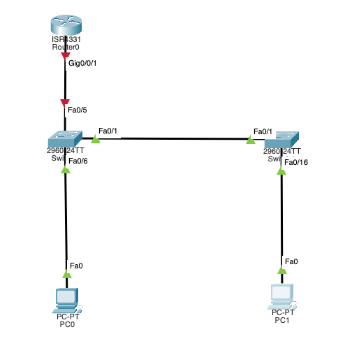

### Домашняя работа 8
# I. Настройка основного сетевого устройства
## 1. Настройте сеть согласно топологии



## 2.Настройте маршрутизатор R1.

a. Загрузите следующий конфигурационный скрипт на R1.
> Кажется, в Packet-Tracer команда ip dhcp relay information trusted недоступна. Я почитал документацию, данная команда активирует механизм который
> Отключает оверрайд поля "Option 82" в DHCP-запросе со стороны роутера. Данное поле содержит некоторую информацию о клиентах, и кажется не является критически
> Важным для выполнения ДЗ.
```bash
R1(config)#
R1(config)#no ip domain lookup
R1(config)#ip dhcp excluded-address 192.168.10.1 192.168.10.9
R1(config)#ip dhcp excluded-address 192.168.10.201 192.168.10.202
R1(config)#ip dhcp pool Students
R1(dhcp-config)#network 192.168.10.0 255.255.255.0
R1(dhcp-config)#default-router 192.168.10.1
R1(dhcp-config)#domain-name CCNA2.Lab-11.6.1
R1(dhcp-config)#interface Loopback0
R1(config-if)# ip address 10.10.1.1 255.255.255.0
R1(config-if)#interface GigabitEthernet0/0/1
R1(config-if)# description Link to S1
R1(config-if)# ip dhcp relay information trusted
**^
% Invalid input detected at '^' marker.**

R1(config-if)# ip address 192.168.10.1 255.255.255.0
R1(config-if)# no shutdown
R1(config-if)#!
R1(config-if)#line con 0
R1(config-line)# logging synchronous
R1(config-line)# exec-timeout 0 0
R1(config-line)#
R1(config-line)#
```

> Дополнительно выведу релевантную конфигурацию роутера после выполнения данных команд.
```bash
ip dhcp excluded-address 192.168.10.1 192.168.10.9
ip dhcp excluded-address 192.168.10.201 192.168.10.202
!
ip dhcp pool Students
 network 192.168.10.0 255.255.255.0
 default-router 192.168.10.1
 domain-name CCNA2.Lab-11.6.1
interface Loopback0
 ip address 10.10.1.1 255.255.255.0
!
interface GigabitEthernet0/0/0
 no ip address
 duplex auto
 speed auto
 shutdown
!
interface GigabitEthernet0/0/1
 description Link to S1
 ip address 192.168.10.1 255.255.255.0
 duplex auto
 speed auto
!
```

b. Проверьте текущую конфигурацию на R1, используя следующую команд

```bash
R1#show ip int brief
Interface              IP-Address      OK? Method Status                Protocol 
GigabitEthernet0/0/0   unassigned      YES unset  administratively down down 
GigabitEthernet0/0/1   192.168.10.1    YES manual up                    up 
GigabitEthernet0/0/2   unassigned      YES unset  administratively down down 
Loopback0              10.10.1.1       YES manual up                    up 
Vlan1                  unassigned      YES unset  administratively down down
```

## 3. Настройка и проверка основных параметров коммутатора
a. Настройте имя хоста для коммутаторов S1 и S2.
b. Запретите нежелательный поиск в DNS.
c. Настройте описания интерфейса для портов, которые используются в S1 и S2.
d. Установите для шлюза по умолчанию для VLAN управления значение 192.168.10.1 на обоих коммутаторах.

```bash
Switch(config)#hostname S1
S1(config)#
S1(config)#no ip domain lookup
S1(config)#int f0/6
S1(config-if)#description PC-A
S1(config-if)#int f0/1
S1(config-if)#description S2
S1(config-if)#int vlan 10
S1(config-if)#ip default-gateway 192.168.10.1
```

```bash
Switch(config)#hostname S2
S2(config)#
S2(config)#no ip domain lookup
S2(config)#int f0/1
S2(config-if)#descr S1
S2(config-if)#int f0/16
S2(config-if)#descr PC-B
S2(config-if)#int vlan 10
S2(config-if)#ip default-gateway 192.168.10.1
```

# II. Настройка сетей VLAN на коммутаторах.

## 1. Сконфигруриуйте VLAN 10.
```bash
S1(config)#vlan 10
S1(config-vlan)#name Management
```

```bash
S2(config)#vlan 10
S2(config-vlan)#name Management
```

## 2. Сконфигруриуйте SVI для VLAN 10.

```bash
S1(config-vlan)#int vlan 10
S1(config-if)#ip address 192.168.10.201 255.255.255.0 
S1(config-if)#descr Management VLAN
S1(config-if)#no shut
```
```bash
S2(config-vlan)#int vlan 10
S2(config-if)#ip address 192.168.10.202 255.255.255.0
S2(config-if)#descr Management VLAN
S2(config-if)#no shut
```

## 3. Настройте VLAN 333 с именем Native на S1 и S2.
## 4. Настройте VLAN 999 с именем ParkingLot на S1 и S2.

```bash
S1(config)#vlan 333
S1(config-vlan)#name Native
S1(config-vlan)#vlan 999
S1(config-vlan)#name Parking_Lot
```

```bash
S2(config)#vlan 333
S2(config-vlan)#name Native
S2(config-vlan)#vlan 999
S2(config-vlan)#name Parking_Lot
```

# Часть III. Настройки безопасности коммутатора.
## 1.Релизация магистральных соединений 802.1Q.

a. Настройте все магистральные порты Fa0/1 на обоих коммутаторах для использования VLAN 333 в качестве native VLAN.
b. Убедитесь, что режим транкинга успешно настроен на всех коммутаторах.

```bash
S1(config-vlan)#int f0/1
S1(config-if)#switchport trunk native vlan 333
S1(config-if)#switchport mode trunk
S1(config-if)#switchport trunk allowed vlan 1,10,333,999
S1(config-if)#end
S1#show int trunk
Port        Mode         Encapsulation  Status        Native vlan
Fa0/1       on           802.1q         trunking      333

Port        Vlans allowed on trunk
Fa0/1       1,10,333,999

Port        Vlans allowed and active in management domain
Fa0/1       1,10,333,999

Port        Vlans in spanning tree forwarding state and not pruned
Fa0/1       999
S1#
```

```bash
S2(config-vlan)#int f0/1
S2(config-if)#switchport trunk native vlan 333
S2(config-if)#switchport mode trunk
S2(config-if)#switchport trunk allowed vlan 1,10,333,999
S2(config-if)#end
Sw#show int trunk
Port        Mode         Encapsulation  Status        Native vlan
Fa0/1       on           802.1q         trunking      333

Port        Vlans allowed on trunk
Fa0/1       1,10,333,999

Port        Vlans allowed and active in management domain
Fa0/1       1,10,333,999

Port        Vlans in spanning tree forwarding state and not pruned
Fa0/1       999
S2#
```

c. Отключить согласование DTP F0/1 на S1 и S2.
d. Проверьте с помощью команды show interfaces.

```bash
S1(config)#int f0/1
S1(config-if)#switchport nonegotiate
..
S1#show interfaces f0/1 switchport | include Negotiation
Negotiation of Trunking: Off
```

```bash
S2(config)#int f0/1
S2(config-if)#switchport nonegotiate
..
S2#show interfaces f0/1 switchport | include Negotiation
Negotiation of Trunking: Off
```

## 2. Настройка портов доступа

a. На S1 настройте F0/5 и F0/6 в качестве портов доступа и свяжите их с VLAN 10.

```bash
S1(config)#int range f0/5,f0/6
S1(config-if-range)#switchport mode access
S1(config-if-range)#switchport access vlan 10
```

b. На S2 настройте порт доступа Fa0/18 и свяжите его с VLAN 10.

```bash
S2(config)#int f0/18
S2(config-if)#switchport mode access
S2(config-if)#switchport access vlan 10
```

## 3. Безопасность неиспользуемых портов коммутатора

a. На S1 и S2 переместите неиспользуемые порты из VLAN 1 в VLAN 999 и отключите неиспользуемые порты.

```bash
S1(config)#int range f0/2-4,f0/7-24,g0/1-2
S1(config-if-range)#switchport mode access
S1(config-if-range)#switchport nonegotiate
S1(config-if-range)#switchport access vlan 999
S1(config-if-range)#shut
```

```bash
S2(config-if)#int range f0/2-15,f0/17-24,g0/1-2
S2(config-if-range)#switchport mode access
S2(config-if-range)#switchport access vlan 999
S2(config-if-range)#switchport nonegotiate
S2(config-if-range)#shut
```

b. Убедитесь, что неиспользуемые порты отключены и связаны с VLAN 999, введя команду  show. 

```bash
S1#show interfaces status
Port      Name               Status       Vlan       Duplex  Speed Type
Fa0/1     S2                 connected    trunk      auto    auto  10/100BaseTX
Fa0/2                        disabled 999        auto    auto  10/100BaseTX
Fa0/3                        disabled 999        auto    auto  10/100BaseTX
Fa0/4                        disabled 999        auto    auto  10/100BaseTX
Fa0/5                        connected    10         auto    auto  10/100BaseTX
Fa0/6     PC-A               connected    10         auto    auto  10/100BaseTX
Fa0/7                        disabled 999        auto    auto  10/100BaseTX
Fa0/8                        disabled 999        auto    auto  10/100BaseTX
Fa0/9                        disabled 999        auto    auto  10/100BaseTX
Fa0/10                       disabled 999        auto    auto  10/100BaseTX
Fa0/11                       disabled 999        auto    auto  10/100BaseTX
Fa0/12                       disabled 999        auto    auto  10/100BaseTX
Fa0/13                       disabled 999        auto    auto  10/100BaseTX
Fa0/14                       disabled 999        auto    auto  10/100BaseTX
Fa0/15                       disabled 999        auto    auto  10/100BaseTX
Fa0/16                       disabled 999        auto    auto  10/100BaseTX
Fa0/17                       disabled 999        auto    auto  10/100BaseTX
Fa0/18                       disabled 999        auto    auto  10/100BaseTX
Fa0/19                       disabled 999        auto    auto  10/100BaseTX
Fa0/20                       disabled 999        auto    auto  10/100BaseTX
Fa0/21                       disabled 999        auto    auto  10/100BaseTX
Fa0/22                       disabled 999        auto    auto  10/100BaseTX
Fa0/23                       disabled 999        auto    auto  10/100BaseTX
Fa0/24                       disabled 999        auto    auto  10/100BaseTX
Gig0/1                       disabled 999        auto    auto  10/100BaseTX
Gig0/2                       disabled 999        auto    auto  10/100BaseTX
```

> Здесь я обнаружил ошибку (перепутал 16 и 18 порты). В дальнейшем я ее исправил.
```bash
S2#show interfaces status
Port      Name               Status       Vlan       Duplex  Speed Type
Fa0/1     S1                 connected    trunk      auto    auto  10/100BaseTX
Fa0/2                        disabled 999        auto    auto  10/100BaseTX
Fa0/3                        disabled 999        auto    auto  10/100BaseTX
Fa0/4                        disabled 999        auto    auto  10/100BaseTX
Fa0/5                        disabled 999        auto    auto  10/100BaseTX
Fa0/6                        disabled 999        auto    auto  10/100BaseTX
Fa0/7                        disabled 999        auto    auto  10/100BaseTX
Fa0/8                        disabled 999        auto    auto  10/100BaseTX
Fa0/9                        disabled 999        auto    auto  10/100BaseTX
Fa0/10                       disabled 999        auto    auto  10/100BaseTX
Fa0/11                       disabled 999        auto    auto  10/100BaseTX
Fa0/12                       disabled 999        auto    auto  10/100BaseTX
Fa0/13                       disabled 999        auto    auto  10/100BaseTX
Fa0/14                       disabled 999        auto    auto  10/100BaseTX
Fa0/15                       disabled 999        auto    auto  10/100BaseTX
Fa0/16    PC-B               connected    10         auto    auto  10/100BaseTX
Fa0/17                       disabled 999        auto    auto  10/100BaseTX
Fa0/18                       disabled 999        auto    auto  10/100BaseTX
Fa0/19                       disabled 999        auto    auto  10/100BaseTX
Fa0/20                       disabled 999        auto    auto  10/100BaseTX
Fa0/21                       disabled 999        auto    auto  10/100BaseTX
Fa0/22                       disabled 999        auto    auto  10/100BaseTX
Fa0/23                       disabled 999        auto    auto  10/100BaseTX
Fa0/24                       disabled 999        auto    auto  10/100BaseTX
Gig0/1                       disabled 999        auto    auto  10/100BaseTX
Gig0/2                       disabled 999        auto    auto  10/100BaseTX
```

4. Документирование и реализация функций безопасности порта
a. На S1, введите команду show port-security interface f0/6  для отображения настроек по умолчанию безопасности порта для интерфейса F0/6. Запишите свои ответы ниже.


b. На S1 включите защиту порта на F0 / 6 со следующими настройками:
> К сожалению aging-type = inactivity задать на PT не получилось.
```bash
S1(config-if)#switchport port-security max 3
S1(config-if)#switchport port-security violation restrict
S1(config-if)#switchport port-security aging ?
  time  Port-security aging time
S1(config-if)#switchport port-security aging ?
  time  Port-security aging time
S1(config-if)#switchport port-security aging time 60
S1(config-if)#switchport port-security aging type inactive
                                              ^
% Invalid input detected at '^' marker.
	
S1(config-if)#switchport port-security aging type inactivity
                                              ^
% Invalid input detected at '^' marker.
```

c. Verify port security on S1 F0/6.
> Тут почему-то на заморском языке написано
```bash
S1#show port-security interface f0/6
Port Security              : Enabled
Port Status                : Secure-up
Violation Mode             : Restrict
Aging Time                 : 60 mins
Aging Type                 : Absolute
SecureStatic Address Aging : Disabled
Maximum MAC Addresses      : 3
Total MAC Addresses        : 0
Configured MAC Addresses   : 0
Sticky MAC Addresses       : 0
Last Source Address:Vlan   : 0000.0000.0000:0
Security Violation Count   : 0
```

```bash
S1#show port-security address
               Secure Mac Address Table
-----------------------------------------------------------------------------
Vlan    Mac Address       Type                          Ports   Remaining Age
                                                                   (mins)
----    -----------       ----                          -----   -------------
-----------------------------------------------------------------------------
Total Addresses in System (excluding one mac per port)     : 0
Max Addresses limit in System (excluding one mac per port) : 1024
```

d. Включите безопасность порта для F0 / 18 на S2. Настройте каждый активный порт доступа таким образом, чтобы он автоматически добавлял адреса МАС, изученные на этом порту, в текущую конфигурацию.
```bash
S2(config)#int f0/18
S2(config-if)#switchport port-security max 2
S2(config-if)#switchport port-security aging time 60
S2(config-if)#switchport port-security violation protect
```


f. Проверка функции безопасности портов на S2 F0/18.
> Тут я обнаружил что случайно перепутал порты f0/16 и f0/18. Переделал.
```bash
S2(config)#int f0/16
S2(config-if)#switchport access vlan 999
S2(config-if)#shut
S2(config-if)#int f0/18
S2(config-if)#switchport access vlan 10
S2(config-if)#no shut
```

> Теперь все ОК
```bash
interface FastEthernet0/18
 switchport access vlan 10
 switchport mode access
 switchport nonegotiate
 switchport port-security
 switchport port-security maximum 2
 switchport port-security violation protect 
 switchport port-security aging time 60
```

> Вывожу состояние port-security
```bash

S2#  show port-security interface f0/18
Port Security              : Enabled
Port Status                : Secure-up
Violation Mode             : Protect
Aging Time                 : 60 mins
Aging Type                 : Absolute
SecureStatic Address Aging : Disabled
Maximum MAC Addresses      : 2
Total MAC Addresses        : 0
Configured MAC Addresses   : 0
Sticky MAC Addresses       : 0
Last Source Address:Vlan   : 0000.0000.0000:0
Security Violation Count   : 0
```

```bash
S2#show port-security address
               Secure Mac Address Table
-----------------------------------------------------------------------------
Vlan    Mac Address       Type                          Ports   Remaining Age
                                                                   (mins)
----    -----------       ----                          -----   -------------
-----------------------------------------------------------------------------
Total Addresses in System (excluding one mac per port)     : 0
Max Addresses limit in System (excluding one mac per port) : 1024
```

## 5. Реализовать безопасность DHCP snooping.
a. На S2 включите DHCP snooping и настройте DHCP snooping во VLAN 10.
b. Настройте магистральные порты на S2 как доверенные порты.
c. Ограничьте ненадежный порт Fa0/18 на S2 пятью DHCP-пакетами в секунду.

```bash
S2(config)#ip dhcp snooping
S2(config)#ip dhcp snooping vlan 10
S2(config)#no ip dhcp snooping information option
S2(config)#int f0/18
S2(config-if)#ip dhcp snoop limit rate 5
S2(config-if)#int f0/1
S2(config-if)#ip dhcp snoop trust
```

d. Проверка DHCP Snooping на S2.

```bash
S2#show ip dhcp snooping
Switch DHCP snooping is enabled
DHCP snooping is configured on following VLANs:
10
**Insertion of option 82 is disabled**
Option 82 on untrusted port is not allowed
Verification of hwaddr field is enabled
Interface                  Trusted    Rate limit (pps)
-----------------------    -------    ----------------
FastEthernet0/1            yes        unlimited       
FastEthernet0/17           yes        unlimited       
FastEthernet0/18           no         5        
```

e. В командной строке на PC-B освободите, а затем обновите IP-адрес.
```bash
C:\>ipconfig /renew

   IP Address......................: 192.168.10.10
   Subnet Mask.....................: 255.255.255.0
   Default Gateway.................: 192.168.10.1
   DNS Server......................: 0.0.0.0
```

## 6. Реализация PortFast и BPDU Guard
a. Настройте PortFast на всех портах доступа, которые используются на обоих коммутаторах.
b. Включите защиту BPDU на портах доступа VLAN 10 S1 и S2, подключенных к PC-A и PC-B.

```bash
S1(config)#int f0/5-6
S1(config-if-range)#spanning-tree portfast
S1(config-if-range)#spanning-tree bpduguard enable

```

> Тут я дополнительно включил portfast на 17 порту, для отладки.
```bash
S2(config)#int range f0/17-18
S2(config-if-range)#spanning-tree portfast
S2(config-if-range)#spanning-tree bpduguard enable
```

c. Убедитесь, что защита BPDU и PortFast включены на соответствующих портах.
> Тут опять же, кажется есть какие-то ограничения у PT. У меня в выводе команды show spanning-tree interface <PORT> detail не отображается ничего про bpduguard.

```bash
show spanning-tree interface f0/6 detail


Port 6 (FastEthernet0/6) of VLAN0010 is designated forwarding
  Port path cost 19, Port priority 128, Port Identifier 128.6
  Designated root has priority 32778, address 0050.0F4A.9751
  Designated bridge has priority 32778, address 00D0.5852.8650
  Designated port id is 128.6, designated path cost 19
  Timers: message age 16, forward delay 0, hold 0
  Number of transitions to forwarding state: 1
  The port is in the portfast mode
  Link type is point-to-point by default
```

## 7. Проверьте наличие сквозного подключения.

> PC-B -> Gateway
```bash
C:\>ping 192.168.10.1

Pinging 192.168.10.1 with 32 bytes of data:

Reply from 192.168.10.1: bytes=32 time<1ms TTL=255
Reply from 192.168.10.1: bytes=32 time<1ms TTL=255
Reply from 192.168.10.1: bytes=32 time<1ms TTL=255
Reply from 192.168.10.1: bytes=32 time<1ms TTL=255

Ping statistics for 192.168.10.1:
    Packets: Sent = 4, Received = 4, Lost = 0 (0% loss),
Approximate round trip times in milli-seconds:
    Minimum = 0ms, Maximum = 0ms, Average = 0ms
```

> PC-B -> S2
```bash
C:\>ping 192.168.10.202

Pinging 192.168.10.202 with 32 bytes of data:

Request timed out.
Reply from 192.168.10.202: bytes=32 time<1ms TTL=255
```

> PC-A -> S1
```bash
C:\>ping 192.168.10.201

Pinging 192.168.10.201 with 32 bytes of data:

Request timed out.
Reply from 192.168.10.201: bytes=32 time<1ms TTL=255
Reply from 192.168.10.201: bytes=32 time<1ms TTL=255
```

> PC-A -> Gateway
```bash
C:\>ping 192.168.10.1

Pinging 192.168.10.1 with 32 bytes of data:

Reply from 192.168.10.1: bytes=32 time<1ms TTL=255
Reply from 192.168.10.1: bytes=32 time<1ms TTL=255
Reply from 192.168.10.1: bytes=32 time<1ms TTL=255
Reply from 192.168.10.1: bytes=32 time<1ms TTL=255

Ping statistics for 192.168.10.1:
    Packets: Sent = 4, Received = 4, Lost = 0 (0% loss),
Approximate round trip times in milli-seconds:
    Minimum = 0ms, Maximum = 0ms, Average = 0ms
```

> PC-A -> S2
```bash
C:\>ping 192.168.10.202

Pinging 192.168.10.202 with 32 bytes of data:

Request timed out.
Reply from 192.168.10.202: bytes=32 time=9ms TTL=255
Reply from 192.168.10.202: bytes=32 time<1ms TTL=255
```

# Вопросы для повторения

## 1. С точки зрения безопасности порта на S2, почему нет значения таймера для оставшегося возраста в минутах, когда было сконфигурировано динамическое обучение - sticky?
> Стики адреса не имеют таймера устаревания.
## 2. Что касается безопасности порта на S2, если вы загружаете скрипт текущей конфигурации на S2, почему порту 18 на PC-B никогда не получит IP-адрес через DHCP?
> Вопрос не совсем понятен, что под собой подразумевает загрузку скрипта текущей конфигурации? Если мы берем за референс предыдущий вопрос, и допустим что у нас выполнена команда switchport port-security mac-address sticky, то при переподключении устройства с другим MAC адресом мы натолкнемся на то что с конфигурацией switchport port-security violation protect, DHCP запросы будут дропаться. Соответственно, устройство не получит айпи адрес. 
## 3. Что касается безопасности порта, в чем разница между типом абсолютного устаревания и типом устаревание по неактивности?
> Абсолютное устаревание удаляет адрес по истечении заданного времени, а устаревание по неактивности - только если устройство неактивно.